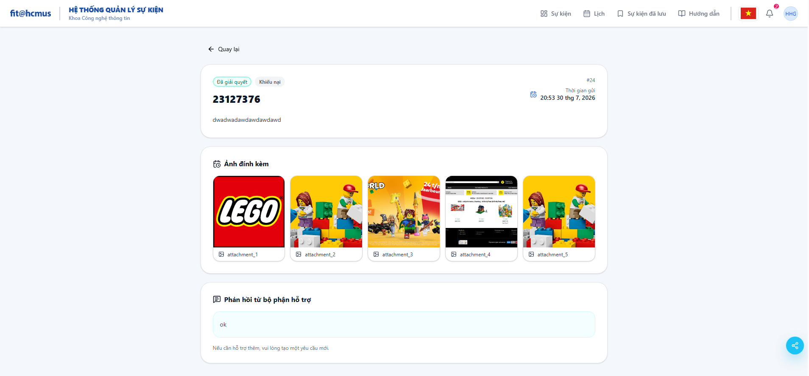

# BUG-D2-02

| Trường | Nội dung |
|---|---|
| **Màn hình** | D2 — Chi tiết Yêu cầu hỗ trợ (VD: request #24) |
| **Mã checklist liên quan** | IA03-02 |
| **Ngày giờ phát hiện** | (điền ngày giờ test thực tế) |
| **Vai trò khi test** | User |
| **Mức độ nghiêm trọng (0–4)** | 1 |

## Bước tái hiện (Steps to Reproduce)
1. Từ danh sách "Yêu cầu hỗ trợ" (D2), click vào 1 request bất kỳ (VD: request #24 "23127376").
2. Trang chuyển sang route/URL riêng cho chi tiết request đó.
3. Quan sát phần đầu trang, phía trên tiêu đề nội dung.

## Kỳ vọng (Expected)
Có breadcrumb hiển thị ngữ cảnh điều hướng, dạng "Yêu cầu hỗ trợ > #24", giúp người dùng biết đang ở đâu và có thể click từng cấp để quay lại.

## Thực tế (Actual)
Chỉ có nút "← Quay lại" đơn thuần, không có breadcrumb thể hiện ngữ cảnh trang hiện tại.

## Ảnh chụp

## Ghi chú thêm
Trang này là route riêng (đổi URL), không phải modal, nên tiêu chí breadcrumb áp dụng đầy đủ, không phải N/A.
