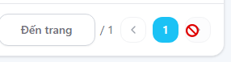

# BUG-D2-05

| Trường | Nội dung |
|---|---|
| **Màn hình** | D2 — My Requests (Yêu cầu hỗ trợ) |
| **Mã checklist liên quan** | IA04-10 |
| **Ngày giờ phát hiện** | 31/07/2026 |
| **Vai trò khi test** | User |
| **Mức độ nghiêm trọng (0–4)** | 1 |

## Bước tái hiện (Steps to Reproduce)
1. Vào trang "Yêu cầu hỗ trợ" (D2).
2. Di chuột (hover) vào các nút chỉ có icon (không kèm text).

## Kỳ vọng (Expected)
Tooltip xuất hiện giải thích ý nghĩa của icon khi hover.

## Thực tế (Actual)
Không có tooltip nào xuất hiện khi hover vào các nút chỉ có icon.

## Ảnh chụp

## Ghi chú thêm
Cùng vấn đề với BUG-D1-07 (D1) — có thể là lỗi hệ thống (component dùng chung), không phải lỗi riêng lẻ từng màn hình.
