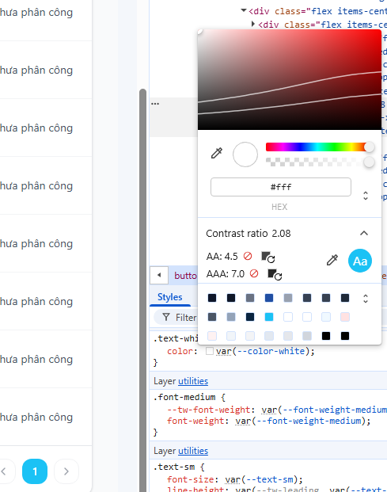

# BUG-D3-01

| Trường | Nội dung |
|---|---|
| **Màn hình** | D3 — Danh sách Support Requests (Admin) |
| **Mã checklist liên quan** | IA01-03 |
| **Ngày giờ phát hiện** | 31/07/2026 |
| **Vai trò khi test** | Admin |
| **Mức độ nghiêm trọng (0–4)** | 0 |

## Bước tái hiện (Steps to Reproduce)
1. Vào trang danh sách Support Requests (D3), cuộn xuống khu vực phân trang cuối danh sách.
2. Quan sát màu sắc của dấu `<` `>` (nút chuyển trang).

## Kỳ vọng (Expected)
Contrast ratio giữa dấu `<` `>` và nền đủ cao để nhìn rõ, đạt chuẩn khả năng đọc.

## Thực tế (Actual)
Màu sắc dấu `<` `>` chuyển trang có độ tương phản thấp so với nền, khó nhìn.

## Ảnh chụp

## Ghi chú thêm
Lỗi cosmetic, không chặn chức năng chuyển trang, nhưng ảnh hưởng khả năng tiếp cận (accessibility).
