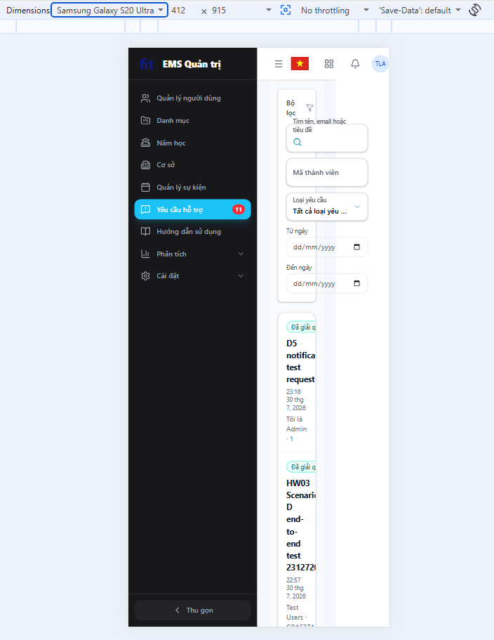

# BUG-D3-02

| Trường | Nội dung |
|---|---|
| **Màn hình** | D3 — Danh sách Support Requests (Admin) |
| **Mã checklist liên quan** | IA01-08 |
| **Ngày giờ phát hiện** | 31/07/2026 |
| **Vai trò khi test** | Admin |
| **Mức độ nghiêm trọng (0–4)** | 2 |

## Bước tái hiện (Steps to Reproduce)
1. Vào trang danh sách Support Requests (D3) trên trình duyệt.
2. Thu nhỏ cửa sổ về kích thước mobile hoặc mở DevTools → Toggle Device Toolbar (Ctrl+Shift+M), chọn 1 thiết bị mobile.
3. Quan sát bố cục trang.

## Kỳ vọng (Expected)
Giao diện tự điều chỉnh (responsive) phù hợp với màn hình mobile, không lỗi tràn/vỡ layout, không cuộn ngang vô lý.

## Thực tế (Actual)
Trên mobile, giao diện không responsive — bố cục bị vỡ/tràn, ảnh hưởng khả năng sử dụng của admin trên thiết bị di động.

## Ảnh chụp

## Ghi chú thêm
Ảnh hưởng đáng kể nếu admin cần xử lý support request khi đang di chuyển, chỉ có điện thoại.
