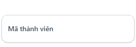

# BUG-D3-04

| Trường | Nội dung |
|---|---|
| **Màn hình** | D3 — Danh sách Support Requests (Admin) |
| **Mã checklist liên quan** | IA02-03 |
| **Ngày giờ phát hiện** | 31/07/2026 |
| **Vai trò khi test** | Admin |
| **Mức độ nghiêm trọng (0–4)** | 1 |

## Bước tái hiện (Steps to Reproduce)
1. Vào trang danh sách Support Requests (D3).
2. Quan sát ô tìm kiếm "Mã thành viên".

## Kỳ vọng (Expected)
Placeholder gợi ý định dạng cần nhập (VD: "Nhập mã số sinh viên...") để người dùng không phải đoán.

## Thực tế (Actual)
Ô "Mã thành viên" không có placeholder, admin phải tự suy đoán đây là mã số sinh viên mới nhập đúng.

## Ảnh chụp

## Ghi chú thêm
Ảnh hưởng khả năng học hệ thống (learnability) với admin mới, chưa quen quy ước dữ liệu.
