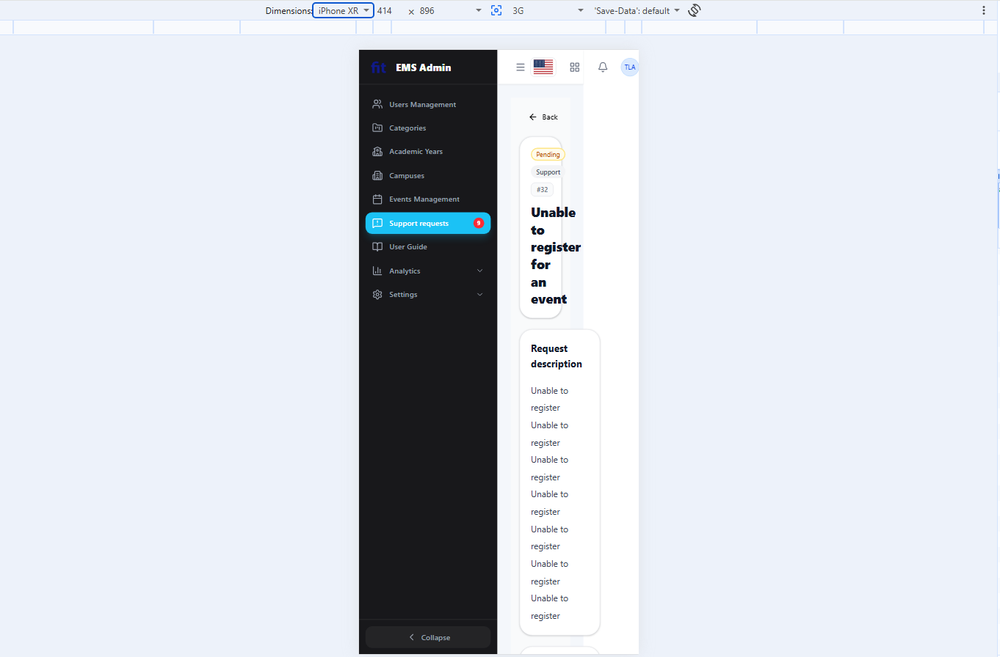

# BUG-D4-01

| Trường | Nội dung |
|---|---|
| **Màn hình** | D4 — Chi tiết Request (Admin) |
| **Mã checklist liên quan** | IA01-08 |
| **Ngày giờ phát hiện** | 31/07/2026 |
| **Vai trò khi test** | Admin |
| **Mức độ nghiêm trọng (0–4)** | 2 |

## Bước tái hiện (Steps to Reproduce)
1. Vào trang chi tiết 1 Support Request (D4).
2. Thu nhỏ cửa sổ về kích thước mobile hoặc dùng DevTools → Toggle Device Toolbar (Ctrl+Shift+M).
3. Quan sát bố cục trang.

## Kỳ vọng (Expected)
Giao diện responsive tốt trên mobile, không vỡ layout.

## Thực tế (Actual)
Trên mobile, giao diện không responsive.

## Ảnh chụp

## Ghi chú thêm
Cùng vấn đề với BUG-D3-02 (D3) — có thể là lỗi chung ở cấp layout admin, không riêng D4.
