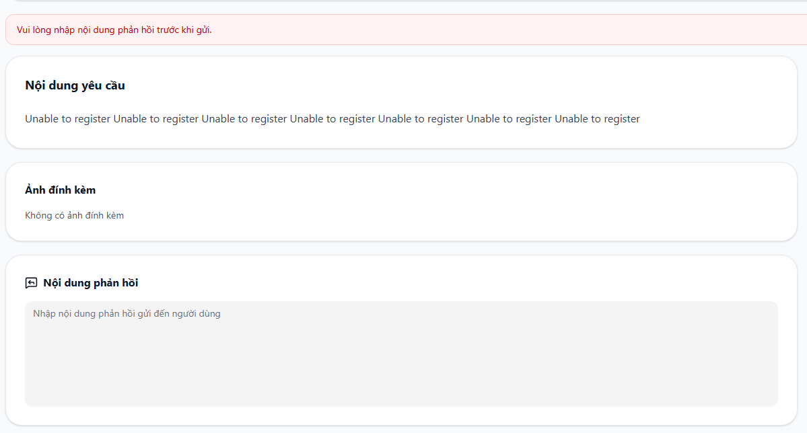

# BUG-D4-02

| Trường | Nội dung |
|---|---|
| **Màn hình** | D4 — Chi tiết Request (Admin) |
| **Mã checklist liên quan** | IA02-02 |
| **Ngày giờ phát hiện** | 31/07/2026 |
| **Vai trò khi test** | Admin |
| **Mức độ nghiêm trọng (0–4)** | 1 |

## Bước tái hiện (Steps to Reproduce)
1. Vào trang chi tiết 1 Support Request (D4).
2. Quan sát trường "Nội dung phản hồi".
3. Thử để trống và bấm gửi.

## Kỳ vọng (Expected)
Trường bắt buộc phải có dấu `*` đỏ hoặc nhãn rõ ràng để phân biệt với trường tùy chọn.

## Thực tế (Actual)
Trường "Nội dung phản hồi" là bắt buộc (không submit được nếu để trống) nhưng không có dấu `*` đánh dấu.

## Ảnh chụp

## Ghi chú thêm
Gây hiểu lầm cho admin, tưởng trường tùy chọn nên có thể bỏ qua rồi bị chặn submit không rõ lý do.
