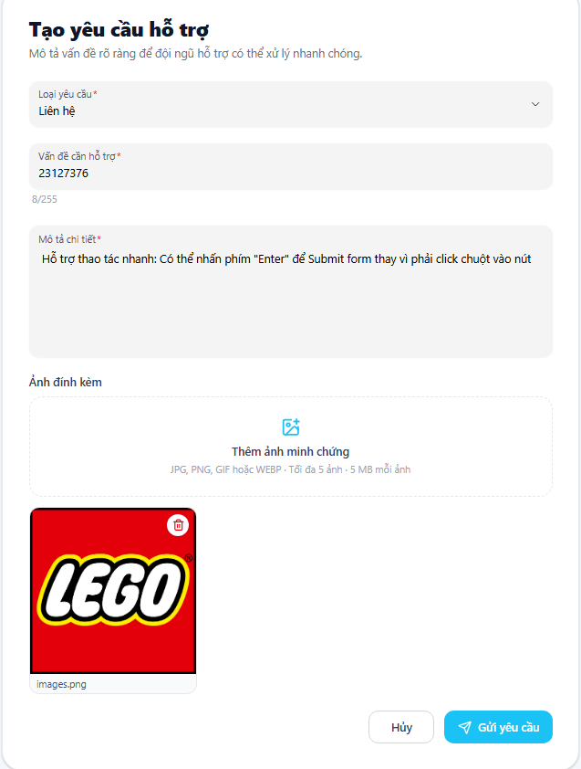
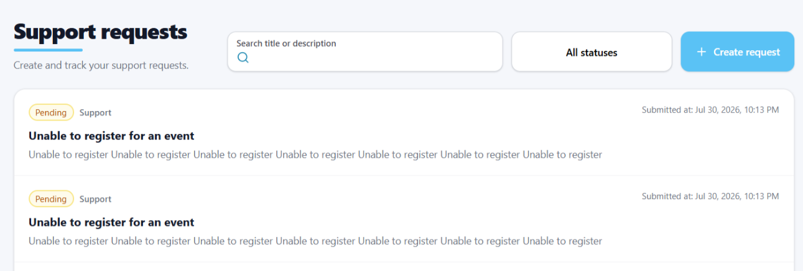
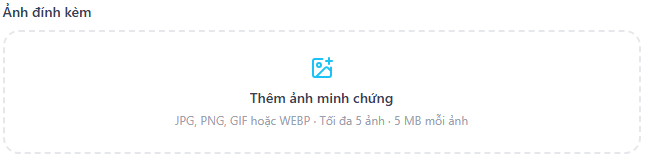
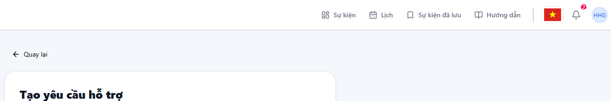
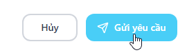
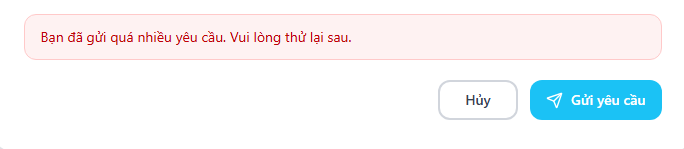

# Checklist Results — Kịch bản D (Support Request)

> Thực thi checklist GUI dùng chung (`00_group/Shared_GUI_Checklist.md`, 57 mục, IA-01→IA-04) trên 4 màn hình D1–D4.
> Quy ước điền:
> - **Kết quả**: `Passed` / `Failed` / `N/A` (N/A nếu mục không áp dụng cho màn hình này — phải ghi lý do ngắn ở cột Notes)
> - **Notes**: bắt buộc điền lý do khi Failed hoặc N/A
> - **Ảnh**: chỉ đính kèm cho mục **Failed** — đặt tên file `D{{n}}_{{MaID}}.png`, lưu tại `01_report/screenshots/D{{n}}/`

## D1 — Form tạo Support Request (User)

| Mã ID | Mục kiểm tra | Kết quả | Notes | Ảnh (nếu Failed) |
|---|---|---|---|---|
| IA01-01 | Font chữ (Typography) rõ ràng, kích thước chữ phân cấp đúng (H1 cho tiêu đề trang, H2-H6 cho các vùng phụ). | Passed | | |
| IA01-02 | Màu sắc nhất quán theo SUT (Primary: Xanh dương cho action chính, Danger: Đỏ cho Xóa/Block). | Passed | | |
| IA01-03 | Độ tương phản màu sắc (Contrast Ratio) giữa chữ và nền đủ cao để dễ đọc (Cater to Universal Usability). | Passed | | |
| IA01-04 | Tính năng chuyển đổi ngôn ngữ EN/VI hoạt động mượt mà, dịch thuật đồng nhất trên toàn bộ hệ thống. | Passed| | |
| IA01-05 | Text không bị tràn, vỡ layout hoặc bị che khuất khi chuyển sang tiếng Việt (do text thường dài hơn tiếng Anh). | Passed | | |
| IA01-06 | Trạng thái rỗng (Empty State) hiển thị thông báo thân thiện và có hình minh họa (VD: Danh sách Users trống). | Passed | | |
| IA01-07 | Trạng thái tải (Loading/Skeleton) hiển thị rõ ràng khi đang gọi API fetch dữ liệu. | Passed | | |
| IA01-08 | Giao diện hiển thị tốt (Responsive) trên Desktop, Tablet, Mobile; không bị lỗi cuộn ngang vô lý. | Passed | | |
| IA01-09 | Hình ảnh (Thumbnail, Banner sự kiện) hiển thị đúng tỷ lệ chuẩn (4:3, 24:9) không bị kéo giãn. | N/A | Trang Support Request không chứa ảnh |
| IA01-10 | Icon sử dụng nhất quán, hình ảnh khớp với thế giới thực (Icon thùng rác = xóa). | Passed | | |
| IA01-11 | Không có thẻ HTML rác hoặc code bị render trực tiếp trên UI (đặc biệt ở các vùng text động). | Passed | | |
| IA01-12 | Footer và Contact hiển thị đúng cấu hình từ Admin Settings trên toàn bộ hệ thống. | Passed | | |
| IA01-13 | Lượng thông tin hiển thị trên màn hình là vừa đủ (adequate), không quá nhồi nhét gây rối hoặc thiếu hụt thông tin cần thiết. | Passed| | |
| IA01-14 | Giao diện được tổ chức bám sát theo các tác vụ của người dùng (Organized by user tasks). Gom nhóm các thông tin liên quan (Proper grouping of related info) một cách hợp lý. | Passed | | |
| IA01-15 | Dữ liệu khi xuất ra file (Export Excel/CSV) phải đồng nhất về ngôn ngữ, định dạng và hiển thị đầy đủ các cột tương ứng với bảng dữ liệu trên web. | N/A | Màn hình tạo form support không có xuất file excel | |
| IA02-01 | Mọi input field đều có Label rõ ràng, ngắn gọn và dễ hiểu. | Passed | | |
| IA02-02 | Các trường bắt buộc phải có dấu `*` màu đỏ hoặc nhãn rõ ràng để phân biệt với trường Tùy chọn (Optional). | Passed | | |
| IA02-03 | Placeholder text cung cấp ví dụ định dạng hữu ích (VD: "Nhập email của bạn..."). | Passed | | |
| IA02-04 | Hỗ trợ thao tác nhanh: Có thể nhấn phím "Enter" để Submit form thay vì phải click chuột vào nút. | Failed|Enter không submit được form | |
| IA02-05 | Validation lỗi định dạng ngay khi nhập (Real-time) hoặc khi blur (VD: sai định dạng email). | Passed | | |
| IA02-06 | Thông báo lỗi (Error message) hiển thị ngay dưới trường bị lỗi (Inline error), không dùng alert chung chung. | Passed | | |
| IA02-07 | Nội dung thông báo lỗi có tính xây dựng, chỉ rõ nguyên nhân và cách khắc phục. | Passed | | |
| IA02-08 | Vùng Upload File/Ảnh ghi rõ ràng quy định về định dạng và dung lượng tối đa. | Passed | |
| IA02-09 | Sau khi upload ảnh thành công, có hiển thị ảnh Preview trước khi submit form. | Passed | | |
| IA02-10 | Nút Submit bị disable hoặc chuyển sang trạng thái loading khi form đang gửi đi để tránh double-submit. | Failed | Vẫn bị double-submit | |
| IA02-11 | Focus order (bấm phím Tab) di chuyển hợp lý từ trên xuống dưới, trái sang phải trong form. | Passed | | |
| IA02-12 | Outline Focus: Có viền bao quanh rõ ràng khi dùng phím Tab di chuyển vào input/button (Accessibility). | Failed | Khi tab vào ô gửi ảnh không thấy outline nhưng khi ấn space hay enter thì vẫn hiện upload ảnh. | |
| IA02-13 | Form có nhiều bước (VD: Reset Password) hiển thị thanh chỉ báo tiến trình (Step Indicator). | N/A | Form chỉ có 1 bước không cần tiến trình. | |
| IA02-14 | Rich-text editor hoạt động đúng các chức năng format cơ bản (In đậm, In nghiêng, Bullet). | N/A | Không có Rich-text editor mọi thứ đều là dạng plain text bình thường | |
| IA02-15 | Các trường dữ liệu (input fields) hiển thị giá trị mặc định (field default) chính xác và hợp lý. | N/A | Không đặt giá trị mặc định cho ô input | |
| IA03-01 | Thanh điều hướng (Navbar/Sidebar) highlight rõ ràng trang hoặc menu đang đứng (Active state). | Failed | Thanh sidebar khi ở trang Support Request không được highlight | |
| IA03-02 | Có Breadcrumb rõ ràng ở các trang con sâu để người dùng dễ dàng hiểu ngữ cảnh và quay lại. | N/A | Không có trang con sâu do chỉ có 1 tầng | |
| IA03-03 | Phân trang (Pagination) hoạt động đúng và tuân theo ánh xạ tự nhiên: Nút lùi bên trái, Nút tiến bên phải. | N/A | Không có phân trang | |
| IA03-04 | Các nút "Back", "Hủy bỏ" luôn sẵn sàng để thoát khỏi luồng hiện tại một cách an toàn. | Passed | | |
| IA03-05 | Bộ lọc (Filter) áp dụng chính xác lên danh sách và UI hiển thị rõ là filter nào đang được bật. | N/A |Form không có filter | |
| IA03-06 | Khung tìm kiếm trả về kết quả đúng; từ khóa tìm kiếm vẫn được giữ lại trong ô input sau khi search. | N/A | Điền biểu mẫu không có search | |
| IA03-07 | Hỗ trợ Deep Linking: Khi copy URL đã filter/search mở ở tab mới, kết quả được giữ nguyên. | N/A | Vì không có filter/search. | |
| IA03-08 | Trạng thái không có kết quả tìm kiếm hiển thị thân thiện, có gợi ý hoặc nút "Xóa bộ lọc". | N/A | Form không có kết quả tìm kiếm. | |
| IA03-09 | Tính năng kéo thả (Reorder) có chỉ báo thị giác (Signifiers) như icon "6 chấm" cho biết có thể kéo. | N/A | Form không có tính năng kéo thả. | |
| IA03-10 | Khi đang kéo thả, item được chọn có phản hồi thị giác (mờ đi, hoặc có viền đổ bóng). | N/A | Form không có tính năng kéo thả. | |
| IA03-11 | Sau khi thả, thứ tự mới được cập nhật ngay lập tức trên UI và thông báo lưu thành công. | N/A | Form không có tính năng kéo thả. | |
| IA04-01 | Hành động thành công trả về Toast Notification màu xanh lá. | N/A | Không có Toast cho màn hình này | |
| IA04-02 | Hành động thất bại trả về Toast Notification màu đỏ với nội dung lỗi cụ thể. | N/A | Không có toast chỉ có inline error trong form. | |
| IA04-03 | Toast notification tự động biến mất sau một khoảng thời gian hợp lý (3-5 giây). | N/A | Không có Toast cho hành động điền/submit form | |
| IA04-04 | Hành động phá hủy (Xóa User, Block User) BẮT BUỘC có Dialog xác nhận (Confirmation). | N/A | Form không có các action trên. | |
| IA04-05 | Nút hành động chính trong Dialog nguy hiểm có màu đỏ (Cảnh báo); nút Hủy nằm ở vị trí an toàn. | N/A | chức năng upload ảnh chỉ mở File Explorer mặc định của OS, không phải UI component của web nên không áp dụng tiêu chí này | |
| IA04-06 | Tương tác chuột (Hover) lên nút bấm, link, hoặc hàng trong table có hiệu ứng chuyển màu hoặc đổ bóng. | Passed | |
| IA04-07 | Tương tác nhấn (Active/Pressed) lên nút bấm có phản hồi lún xuống hoặc đổi màu nền. | Passed| | |
| IA04-08 | Con trỏ chuột đổi thành hình bàn tay (Pointer) khi trỏ vào các vùng có thể tương tác (Clickable). |Passed | | |
| IA04-09 | Các nút bị vô hiệu hóa (Disabled) bị làm mờ, không thể click và đổi con trỏ thành `not-allowed`. | N/A | | |
| IA04-10 | Tooltip xuất hiện giải thích ý nghĩa khi hover vào các nút bấm chỉ có icon (VD: Icon con mắt). | Failed | Không có Tooltip khi hover | |
| IA04-11 | Tích hợp liên kết tới User Guide hoặc Support rõ ràng cho Admin/User khi cần hỗ trợ. | Passed | | |
| IA04-12 | Nút ẩn/hiện mật khẩu (Toggle Password Visibility) hoạt động chính xác trong các form bảo mật. | N/A | Form chỉ điền các thông tin hỗ trợ không yêu cầu bảo mật | |
| IA04-13 | Progress bar hiển thị đúng tỷ lệ % (VD: Tỷ lệ đăng ký, tiến độ duyệt) và đổi màu theo trạng thái. | N/A |Form không có Progress bar | |
| IA04-14 | Dữ liệu Real-time (VD: số lượng Check-in nhảy số) thay đổi trên UI mà không cần reload trang. | N/A| Form là dữ liệu tĩnh. | |
| IA04-15 | Cửa sổ pop-up/dialog phải đảm bảo tính Modality (Correct window modality) – khóa các tương tác với màn hình nền bên dưới khi đang mở. | Passed | | |
| IA04-16 | Trạng thái của các controls và menu đồng bộ và khớp chính xác với trạng thái dữ liệu trong ứng dụng (Synchronization of window object content). | Failed | Mặc dù đang bị limit không thể gửi được yêu cầu hỗ trợ nhưng nút gửi không Disable | |

## D2 — My Requests + Chi tiết (User)

*Danh sách yêu cầu của tôi + trang chi tiết kèm phản hồi chính thức*

| Mã ID | Mục kiểm tra | Kết quả | Notes | Ảnh (nếu Failed) |
|---|---|---|---|---|
| IA01-01 | Font chữ (Typography) rõ ràng, kích thước chữ phân cấp đúng (H1 cho tiêu đề trang, H2-H6 cho các vùng phụ). | *(điền)* | | |
| IA01-02 | Màu sắc nhất quán theo SUT (Primary: Xanh dương cho action chính, Danger: Đỏ cho Xóa/Block). | *(điền)* | | |
| IA01-03 | Độ tương phản màu sắc (Contrast Ratio) giữa chữ và nền đủ cao để dễ đọc (Cater to Universal Usability). | *(điền)* | | |
| IA01-04 | Tính năng chuyển đổi ngôn ngữ EN/VI hoạt động mượt mà, dịch thuật đồng nhất trên toàn bộ hệ thống. | *(điền)* | | |
| IA01-05 | Text không bị tràn, vỡ layout hoặc bị che khuất khi chuyển sang tiếng Việt (do text thường dài hơn tiếng Anh). | *(điền)* | | |
| IA01-06 | Trạng thái rỗng (Empty State) hiển thị thông báo thân thiện và có hình minh họa (VD: Danh sách Users trống). | *(điền)* | | |
| IA01-07 | Trạng thái tải (Loading/Skeleton) hiển thị rõ ràng khi đang gọi API fetch dữ liệu. | *(điền)* | | |
| IA01-08 | Giao diện hiển thị tốt (Responsive) trên Desktop, Tablet, Mobile; không bị lỗi cuộn ngang vô lý. | *(điền)* | | |
| IA01-09 | Hình ảnh (Thumbnail, Banner sự kiện) hiển thị đúng tỷ lệ chuẩn (4:3, 24:9) không bị kéo giãn. | *(điền)* | | |
| IA01-10 | Icon sử dụng nhất quán, hình ảnh khớp với thế giới thực (Icon thùng rác = xóa). | *(điền)* | | |
| IA01-11 | Không có thẻ HTML rác hoặc code bị render trực tiếp trên UI (đặc biệt ở các vùng text động). | *(điền)* | | |
| IA01-12 | Footer và Contact hiển thị đúng cấu hình từ Admin Settings trên toàn bộ hệ thống. | *(điền)* | | |
| IA01-13 | Lượng thông tin hiển thị trên màn hình là vừa đủ (adequate), không quá nhồi nhét gây rối hoặc thiếu hụt thông tin cần thiết. | *(điền)* | | |
| IA01-14 | Giao diện được tổ chức bám sát theo các tác vụ của người dùng (Organized by user tasks). Gom nhóm các thông tin liên quan (Proper grouping of related info) một cách hợp lý. | *(điền)* | | |
| IA01-15 | Dữ liệu khi xuất ra file (Export Excel/CSV) phải đồng nhất về ngôn ngữ, định dạng và hiển thị đầy đủ các cột tương ứng với bảng dữ liệu trên web. | *(điền)* | | |
| IA02-01 | Mọi input field đều có Label rõ ràng, ngắn gọn và dễ hiểu. | *(điền)* | | |
| IA02-02 | Các trường bắt buộc phải có dấu `*` màu đỏ hoặc nhãn rõ ràng để phân biệt với trường Tùy chọn (Optional). | *(điền)* | | |
| IA02-03 | Placeholder text cung cấp ví dụ định dạng hữu ích (VD: "Nhập email của bạn..."). | *(điền)* | | |
| IA02-04 | Hỗ trợ thao tác nhanh: Có thể nhấn phím "Enter" để Submit form thay vì phải click chuột vào nút. | *(điền)* | | |
| IA02-05 | Validation lỗi định dạng ngay khi nhập (Real-time) hoặc khi blur (VD: sai định dạng email). | *(điền)* | | |
| IA02-06 | Thông báo lỗi (Error message) hiển thị ngay dưới trường bị lỗi (Inline error), không dùng alert chung chung. | *(điền)* | | |
| IA02-07 | Nội dung thông báo lỗi có tính xây dựng, chỉ rõ nguyên nhân và cách khắc phục. | *(điền)* | | |
| IA02-08 | Vùng Upload File/Ảnh ghi rõ ràng quy định về định dạng và dung lượng tối đa. | *(điền)* | | |
| IA02-09 | Sau khi upload ảnh thành công, có hiển thị ảnh Preview trước khi submit form. | *(điền)* | | |
| IA02-10 | Nút Submit bị disable hoặc chuyển sang trạng thái loading khi form đang gửi đi để tránh double-submit. | *(điền)* | | |
| IA02-11 | Focus order (bấm phím Tab) di chuyển hợp lý từ trên xuống dưới, trái sang phải trong form. | *(điền)* | | |
| IA02-12 | Outline Focus: Có viền bao quanh rõ ràng khi dùng phím Tab di chuyển vào input/button (Accessibility). | *(điền)* | | |
| IA02-13 | Form có nhiều bước (VD: Reset Password) hiển thị thanh chỉ báo tiến trình (Step Indicator). | *(điền)* | | |
| IA02-14 | Rich-text editor hoạt động đúng các chức năng format cơ bản (In đậm, In nghiêng, Bullet). | *(điền)* | | |
| IA02-15 | Các trường dữ liệu (input fields) hiển thị giá trị mặc định (field default) chính xác và hợp lý. | *(điền)* | | |
| IA03-01 | Thanh điều hướng (Navbar/Sidebar) highlight rõ ràng trang hoặc menu đang đứng (Active state). | *(điền)* | | |
| IA03-02 | Có Breadcrumb rõ ràng ở các trang con sâu để người dùng dễ dàng hiểu ngữ cảnh và quay lại. | *(điền)* | | |
| IA03-03 | Phân trang (Pagination) hoạt động đúng và tuân theo ánh xạ tự nhiên: Nút lùi bên trái, Nút tiến bên phải. | *(điền)* | | |
| IA03-04 | Các nút "Back", "Hủy bỏ" luôn sẵn sàng để thoát khỏi luồng hiện tại một cách an toàn. | *(điền)* | | |
| IA03-05 | Bộ lọc (Filter) áp dụng chính xác lên danh sách và UI hiển thị rõ là filter nào đang được bật. | *(điền)* | | |
| IA03-06 | Khung tìm kiếm trả về kết quả đúng; từ khóa tìm kiếm vẫn được giữ lại trong ô input sau khi search. | *(điền)* | | |
| IA03-07 | Hỗ trợ Deep Linking: Khi copy URL đã filter/search mở ở tab mới, kết quả được giữ nguyên. | *(điền)* | | |
| IA03-08 | Trạng thái không có kết quả tìm kiếm hiển thị thân thiện, có gợi ý hoặc nút "Xóa bộ lọc". | *(điền)* | | |
| IA03-09 | Tính năng kéo thả (Reorder) có chỉ báo thị giác (Signifiers) như icon "6 chấm" cho biết có thể kéo. | *(điền)* | | |
| IA03-10 | Khi đang kéo thả, item được chọn có phản hồi thị giác (mờ đi, hoặc có viền đổ bóng). | *(điền)* | | |
| IA03-11 | Sau khi thả, thứ tự mới được cập nhật ngay lập tức trên UI và thông báo lưu thành công. | *(điền)* | | |
| IA04-01 | Hành động thành công trả về Toast Notification màu xanh lá. | *(điền)* | | |
| IA04-02 | Hành động thất bại trả về Toast Notification màu đỏ với nội dung lỗi cụ thể. | *(điền)* | | |
| IA04-03 | Toast notification tự động biến mất sau một khoảng thời gian hợp lý (3-5 giây). | *(điền)* | | |
| IA04-04 | Hành động phá hủy (Xóa User, Block User) BẮT BUỘC có Dialog xác nhận (Confirmation). | *(điền)* | | |
| IA04-05 | Nút hành động chính trong Dialog nguy hiểm có màu đỏ (Cảnh báo); nút Hủy nằm ở vị trí an toàn. | *(điền)* | | |
| IA04-06 | Tương tác chuột (Hover) lên nút bấm, link, hoặc hàng trong table có hiệu ứng chuyển màu hoặc đổ bóng. | *(điền)* | | |
| IA04-07 | Tương tác nhấn (Active/Pressed) lên nút bấm có phản hồi lún xuống hoặc đổi màu nền. | *(điền)* | | |
| IA04-08 | Con trỏ chuột đổi thành hình bàn tay (Pointer) khi trỏ vào các vùng có thể tương tác (Clickable). | *(điền)* | | |
| IA04-09 | Các nút bị vô hiệu hóa (Disabled) bị làm mờ, không thể click và đổi con trỏ thành `not-allowed`. | *(điền)* | | |
| IA04-10 | Tooltip xuất hiện giải thích ý nghĩa khi hover vào các nút bấm chỉ có icon (VD: Icon con mắt). | *(điền)* | | |
| IA04-11 | Tích hợp liên kết tới User Guide hoặc Support rõ ràng cho Admin/User khi cần hỗ trợ. | *(điền)* | | |
| IA04-12 | Nút ẩn/hiện mật khẩu (Toggle Password Visibility) hoạt động chính xác trong các form bảo mật. | *(điền)* | | |
| IA04-13 | Progress bar hiển thị đúng tỷ lệ % (VD: Tỷ lệ đăng ký, tiến độ duyệt) và đổi màu theo trạng thái. | *(điền)* | | |
| IA04-14 | Dữ liệu Real-time (VD: số lượng Check-in nhảy số) thay đổi trên UI mà không cần reload trang. | *(điền)* | | |
| IA04-15 | Cửa sổ pop-up/dialog phải đảm bảo tính Modality (Correct window modality) – khóa các tương tác với màn hình nền bên dưới khi đang mở. | *(điền)* | | |
| IA04-16 | Trạng thái của các controls và menu đồng bộ và khớp chính xác với trạng thái dữ liệu trong ứng dụng (Synchronization of window object content). | *(điền)* | | |

## D3 — Danh sách Support Requests (Admin)

*Tab Pending/Resolved, tìm theo member code hoặc category*

| Mã ID | Mục kiểm tra | Kết quả | Notes | Ảnh (nếu Failed) |
|---|---|---|---|---|
| IA01-01 | Font chữ (Typography) rõ ràng, kích thước chữ phân cấp đúng (H1 cho tiêu đề trang, H2-H6 cho các vùng phụ). | *(điền)* | | |
| IA01-02 | Màu sắc nhất quán theo SUT (Primary: Xanh dương cho action chính, Danger: Đỏ cho Xóa/Block). | *(điền)* | | |
| IA01-03 | Độ tương phản màu sắc (Contrast Ratio) giữa chữ và nền đủ cao để dễ đọc (Cater to Universal Usability). | *(điền)* | | |
| IA01-04 | Tính năng chuyển đổi ngôn ngữ EN/VI hoạt động mượt mà, dịch thuật đồng nhất trên toàn bộ hệ thống. | *(điền)* | | |
| IA01-05 | Text không bị tràn, vỡ layout hoặc bị che khuất khi chuyển sang tiếng Việt (do text thường dài hơn tiếng Anh). | *(điền)* | | |
| IA01-06 | Trạng thái rỗng (Empty State) hiển thị thông báo thân thiện và có hình minh họa (VD: Danh sách Users trống). | *(điền)* | | |
| IA01-07 | Trạng thái tải (Loading/Skeleton) hiển thị rõ ràng khi đang gọi API fetch dữ liệu. | *(điền)* | | |
| IA01-08 | Giao diện hiển thị tốt (Responsive) trên Desktop, Tablet, Mobile; không bị lỗi cuộn ngang vô lý. | *(điền)* | | |
| IA01-09 | Hình ảnh (Thumbnail, Banner sự kiện) hiển thị đúng tỷ lệ chuẩn (4:3, 24:9) không bị kéo giãn. | *(điền)* | | |
| IA01-10 | Icon sử dụng nhất quán, hình ảnh khớp với thế giới thực (Icon thùng rác = xóa). | *(điền)* | | |
| IA01-11 | Không có thẻ HTML rác hoặc code bị render trực tiếp trên UI (đặc biệt ở các vùng text động). | *(điền)* | | |
| IA01-12 | Footer và Contact hiển thị đúng cấu hình từ Admin Settings trên toàn bộ hệ thống. | *(điền)* | | |
| IA01-13 | Lượng thông tin hiển thị trên màn hình là vừa đủ (adequate), không quá nhồi nhét gây rối hoặc thiếu hụt thông tin cần thiết. | *(điền)* | | |
| IA01-14 | Giao diện được tổ chức bám sát theo các tác vụ của người dùng (Organized by user tasks). Gom nhóm các thông tin liên quan (Proper grouping of related info) một cách hợp lý. | *(điền)* | | |
| IA01-15 | Dữ liệu khi xuất ra file (Export Excel/CSV) phải đồng nhất về ngôn ngữ, định dạng và hiển thị đầy đủ các cột tương ứng với bảng dữ liệu trên web. | *(điền)* | | |
| IA02-01 | Mọi input field đều có Label rõ ràng, ngắn gọn và dễ hiểu. | *(điền)* | | |
| IA02-02 | Các trường bắt buộc phải có dấu `*` màu đỏ hoặc nhãn rõ ràng để phân biệt với trường Tùy chọn (Optional). | *(điền)* | | |
| IA02-03 | Placeholder text cung cấp ví dụ định dạng hữu ích (VD: "Nhập email của bạn..."). | *(điền)* | | |
| IA02-04 | Hỗ trợ thao tác nhanh: Có thể nhấn phím "Enter" để Submit form thay vì phải click chuột vào nút. | *(điền)* | | |
| IA02-05 | Validation lỗi định dạng ngay khi nhập (Real-time) hoặc khi blur (VD: sai định dạng email). | *(điền)* | | |
| IA02-06 | Thông báo lỗi (Error message) hiển thị ngay dưới trường bị lỗi (Inline error), không dùng alert chung chung. | *(điền)* | | |
| IA02-07 | Nội dung thông báo lỗi có tính xây dựng, chỉ rõ nguyên nhân và cách khắc phục. | *(điền)* | | |
| IA02-08 | Vùng Upload File/Ảnh ghi rõ ràng quy định về định dạng và dung lượng tối đa. | *(điền)* | | |
| IA02-09 | Sau khi upload ảnh thành công, có hiển thị ảnh Preview trước khi submit form. | *(điền)* | | |
| IA02-10 | Nút Submit bị disable hoặc chuyển sang trạng thái loading khi form đang gửi đi để tránh double-submit. | *(điền)* | | |
| IA02-11 | Focus order (bấm phím Tab) di chuyển hợp lý từ trên xuống dưới, trái sang phải trong form. | *(điền)* | | |
| IA02-12 | Outline Focus: Có viền bao quanh rõ ràng khi dùng phím Tab di chuyển vào input/button (Accessibility). | *(điền)* | | |
| IA02-13 | Form có nhiều bước (VD: Reset Password) hiển thị thanh chỉ báo tiến trình (Step Indicator). | *(điền)* | | |
| IA02-14 | Rich-text editor hoạt động đúng các chức năng format cơ bản (In đậm, In nghiêng, Bullet). | *(điền)* | | |
| IA02-15 | Các trường dữ liệu (input fields) hiển thị giá trị mặc định (field default) chính xác và hợp lý. | *(điền)* | | |
| IA03-01 | Thanh điều hướng (Navbar/Sidebar) highlight rõ ràng trang hoặc menu đang đứng (Active state). | *(điền)* | | |
| IA03-02 | Có Breadcrumb rõ ràng ở các trang con sâu để người dùng dễ dàng hiểu ngữ cảnh và quay lại. | *(điền)* | | |
| IA03-03 | Phân trang (Pagination) hoạt động đúng và tuân theo ánh xạ tự nhiên: Nút lùi bên trái, Nút tiến bên phải. | *(điền)* | | |
| IA03-04 | Các nút "Back", "Hủy bỏ" luôn sẵn sàng để thoát khỏi luồng hiện tại một cách an toàn. | *(điền)* | | |
| IA03-05 | Bộ lọc (Filter) áp dụng chính xác lên danh sách và UI hiển thị rõ là filter nào đang được bật. | *(điền)* | | |
| IA03-06 | Khung tìm kiếm trả về kết quả đúng; từ khóa tìm kiếm vẫn được giữ lại trong ô input sau khi search. | *(điền)* | | |
| IA03-07 | Hỗ trợ Deep Linking: Khi copy URL đã filter/search mở ở tab mới, kết quả được giữ nguyên. | *(điền)* | | |
| IA03-08 | Trạng thái không có kết quả tìm kiếm hiển thị thân thiện, có gợi ý hoặc nút "Xóa bộ lọc". | *(điền)* | | |
| IA03-09 | Tính năng kéo thả (Reorder) có chỉ báo thị giác (Signifiers) như icon "6 chấm" cho biết có thể kéo. | *(điền)* | | |
| IA03-10 | Khi đang kéo thả, item được chọn có phản hồi thị giác (mờ đi, hoặc có viền đổ bóng). | *(điền)* | | |
| IA03-11 | Sau khi thả, thứ tự mới được cập nhật ngay lập tức trên UI và thông báo lưu thành công. | *(điền)* | | |
| IA04-01 | Hành động thành công trả về Toast Notification màu xanh lá. | *(điền)* | | |
| IA04-02 | Hành động thất bại trả về Toast Notification màu đỏ với nội dung lỗi cụ thể. | *(điền)* | | |
| IA04-03 | Toast notification tự động biến mất sau một khoảng thời gian hợp lý (3-5 giây). | *(điền)* | | |
| IA04-04 | Hành động phá hủy (Xóa User, Block User) BẮT BUỘC có Dialog xác nhận (Confirmation). | *(điền)* | | |
| IA04-05 | Nút hành động chính trong Dialog nguy hiểm có màu đỏ (Cảnh báo); nút Hủy nằm ở vị trí an toàn. | *(điền)* | | |
| IA04-06 | Tương tác chuột (Hover) lên nút bấm, link, hoặc hàng trong table có hiệu ứng chuyển màu hoặc đổ bóng. | *(điền)* | | |
| IA04-07 | Tương tác nhấn (Active/Pressed) lên nút bấm có phản hồi lún xuống hoặc đổi màu nền. | *(điền)* | | |
| IA04-08 | Con trỏ chuột đổi thành hình bàn tay (Pointer) khi trỏ vào các vùng có thể tương tác (Clickable). | *(điền)* | | |
| IA04-09 | Các nút bị vô hiệu hóa (Disabled) bị làm mờ, không thể click và đổi con trỏ thành `not-allowed`. | *(điền)* | | |
| IA04-10 | Tooltip xuất hiện giải thích ý nghĩa khi hover vào các nút bấm chỉ có icon (VD: Icon con mắt). | *(điền)* | | |
| IA04-11 | Tích hợp liên kết tới User Guide hoặc Support rõ ràng cho Admin/User khi cần hỗ trợ. | *(điền)* | | |
| IA04-12 | Nút ẩn/hiện mật khẩu (Toggle Password Visibility) hoạt động chính xác trong các form bảo mật. | *(điền)* | | |
| IA04-13 | Progress bar hiển thị đúng tỷ lệ % (VD: Tỷ lệ đăng ký, tiến độ duyệt) và đổi màu theo trạng thái. | *(điền)* | | |
| IA04-14 | Dữ liệu Real-time (VD: số lượng Check-in nhảy số) thay đổi trên UI mà không cần reload trang. | *(điền)* | | |
| IA04-15 | Cửa sổ pop-up/dialog phải đảm bảo tính Modality (Correct window modality) – khóa các tương tác với màn hình nền bên dưới khi đang mở. | *(điền)* | | |
| IA04-16 | Trạng thái của các controls và menu đồng bộ và khớp chính xác với trạng thái dữ liệu trong ứng dụng (Synchronization of window object content). | *(điền)* | | |

## D4 — Chi tiết Request (Admin)

*Lightbox ảnh, internal note, nội dung phản hồi chính thức*

| Mã ID | Mục kiểm tra | Kết quả | Notes | Ảnh (nếu Failed) |
|---|---|---|---|---|
| IA01-01 | Font chữ (Typography) rõ ràng, kích thước chữ phân cấp đúng (H1 cho tiêu đề trang, H2-H6 cho các vùng phụ). | *(điền)* | | |
| IA01-02 | Màu sắc nhất quán theo SUT (Primary: Xanh dương cho action chính, Danger: Đỏ cho Xóa/Block). | *(điền)* | | |
| IA01-03 | Độ tương phản màu sắc (Contrast Ratio) giữa chữ và nền đủ cao để dễ đọc (Cater to Universal Usability). | *(điền)* | | |
| IA01-04 | Tính năng chuyển đổi ngôn ngữ EN/VI hoạt động mượt mà, dịch thuật đồng nhất trên toàn bộ hệ thống. | *(điền)* | | |
| IA01-05 | Text không bị tràn, vỡ layout hoặc bị che khuất khi chuyển sang tiếng Việt (do text thường dài hơn tiếng Anh). | *(điền)* | | |
| IA01-06 | Trạng thái rỗng (Empty State) hiển thị thông báo thân thiện và có hình minh họa (VD: Danh sách Users trống). | *(điền)* | | |
| IA01-07 | Trạng thái tải (Loading/Skeleton) hiển thị rõ ràng khi đang gọi API fetch dữ liệu. | *(điền)* | | |
| IA01-08 | Giao diện hiển thị tốt (Responsive) trên Desktop, Tablet, Mobile; không bị lỗi cuộn ngang vô lý. | *(điền)* | | |
| IA01-09 | Hình ảnh (Thumbnail, Banner sự kiện) hiển thị đúng tỷ lệ chuẩn (4:3, 24:9) không bị kéo giãn. | *(điền)* | | |
| IA01-10 | Icon sử dụng nhất quán, hình ảnh khớp với thế giới thực (Icon thùng rác = xóa). | *(điền)* | | |
| IA01-11 | Không có thẻ HTML rác hoặc code bị render trực tiếp trên UI (đặc biệt ở các vùng text động). | *(điền)* | | |
| IA01-12 | Footer và Contact hiển thị đúng cấu hình từ Admin Settings trên toàn bộ hệ thống. | *(điền)* | | |
| IA01-13 | Lượng thông tin hiển thị trên màn hình là vừa đủ (adequate), không quá nhồi nhét gây rối hoặc thiếu hụt thông tin cần thiết. | *(điền)* | | |
| IA01-14 | Giao diện được tổ chức bám sát theo các tác vụ của người dùng (Organized by user tasks). Gom nhóm các thông tin liên quan (Proper grouping of related info) một cách hợp lý. | *(điền)* | | |
| IA01-15 | Dữ liệu khi xuất ra file (Export Excel/CSV) phải đồng nhất về ngôn ngữ, định dạng và hiển thị đầy đủ các cột tương ứng với bảng dữ liệu trên web. | *(điền)* | | |
| IA02-01 | Mọi input field đều có Label rõ ràng, ngắn gọn và dễ hiểu. | *(điền)* | | |
| IA02-02 | Các trường bắt buộc phải có dấu `*` màu đỏ hoặc nhãn rõ ràng để phân biệt với trường Tùy chọn (Optional). | *(điền)* | | |
| IA02-03 | Placeholder text cung cấp ví dụ định dạng hữu ích (VD: "Nhập email của bạn..."). | *(điền)* | | |
| IA02-04 | Hỗ trợ thao tác nhanh: Có thể nhấn phím "Enter" để Submit form thay vì phải click chuột vào nút. | *(điền)* | | |
| IA02-05 | Validation lỗi định dạng ngay khi nhập (Real-time) hoặc khi blur (VD: sai định dạng email). | *(điền)* | | |
| IA02-06 | Thông báo lỗi (Error message) hiển thị ngay dưới trường bị lỗi (Inline error), không dùng alert chung chung. | *(điền)* | | |
| IA02-07 | Nội dung thông báo lỗi có tính xây dựng, chỉ rõ nguyên nhân và cách khắc phục. | *(điền)* | | |
| IA02-08 | Vùng Upload File/Ảnh ghi rõ ràng quy định về định dạng và dung lượng tối đa. | *(điền)* | | |
| IA02-09 | Sau khi upload ảnh thành công, có hiển thị ảnh Preview trước khi submit form. | *(điền)* | | |
| IA02-10 | Nút Submit bị disable hoặc chuyển sang trạng thái loading khi form đang gửi đi để tránh double-submit. | *(điền)* | | |
| IA02-11 | Focus order (bấm phím Tab) di chuyển hợp lý từ trên xuống dưới, trái sang phải trong form. | *(điền)* | | |
| IA02-12 | Outline Focus: Có viền bao quanh rõ ràng khi dùng phím Tab di chuyển vào input/button (Accessibility). | *(điền)* | | |
| IA02-13 | Form có nhiều bước (VD: Reset Password) hiển thị thanh chỉ báo tiến trình (Step Indicator). | *(điền)* | | |
| IA02-14 | Rich-text editor hoạt động đúng các chức năng format cơ bản (In đậm, In nghiêng, Bullet). | *(điền)* | | |
| IA02-15 | Các trường dữ liệu (input fields) hiển thị giá trị mặc định (field default) chính xác và hợp lý. | *(điền)* | | |
| IA03-01 | Thanh điều hướng (Navbar/Sidebar) highlight rõ ràng trang hoặc menu đang đứng (Active state). | *(điền)* | | |
| IA03-02 | Có Breadcrumb rõ ràng ở các trang con sâu để người dùng dễ dàng hiểu ngữ cảnh và quay lại. | *(điền)* | | |
| IA03-03 | Phân trang (Pagination) hoạt động đúng và tuân theo ánh xạ tự nhiên: Nút lùi bên trái, Nút tiến bên phải. | *(điền)* | | |
| IA03-04 | Các nút "Back", "Hủy bỏ" luôn sẵn sàng để thoát khỏi luồng hiện tại một cách an toàn. | *(điền)* | | |
| IA03-05 | Bộ lọc (Filter) áp dụng chính xác lên danh sách và UI hiển thị rõ là filter nào đang được bật. | *(điền)* | | |
| IA03-06 | Khung tìm kiếm trả về kết quả đúng; từ khóa tìm kiếm vẫn được giữ lại trong ô input sau khi search. | *(điền)* | | |
| IA03-07 | Hỗ trợ Deep Linking: Khi copy URL đã filter/search mở ở tab mới, kết quả được giữ nguyên. | *(điền)* | | |
| IA03-08 | Trạng thái không có kết quả tìm kiếm hiển thị thân thiện, có gợi ý hoặc nút "Xóa bộ lọc". | *(điền)* | | |
| IA03-09 | Tính năng kéo thả (Reorder) có chỉ báo thị giác (Signifiers) như icon "6 chấm" cho biết có thể kéo. | *(điền)* | | |
| IA03-10 | Khi đang kéo thả, item được chọn có phản hồi thị giác (mờ đi, hoặc có viền đổ bóng). | *(điền)* | | |
| IA03-11 | Sau khi thả, thứ tự mới được cập nhật ngay lập tức trên UI và thông báo lưu thành công. | *(điền)* | | |
| IA04-01 | Hành động thành công trả về Toast Notification màu xanh lá. | *(điền)* | | |
| IA04-02 | Hành động thất bại trả về Toast Notification màu đỏ với nội dung lỗi cụ thể. | *(điền)* | | |
| IA04-03 | Toast notification tự động biến mất sau một khoảng thời gian hợp lý (3-5 giây). | *(điền)* | | |
| IA04-04 | Hành động phá hủy (Xóa User, Block User) BẮT BUỘC có Dialog xác nhận (Confirmation). | *(điền)* | | |
| IA04-05 | Nút hành động chính trong Dialog nguy hiểm có màu đỏ (Cảnh báo); nút Hủy nằm ở vị trí an toàn. | *(điền)* | | |
| IA04-06 | Tương tác chuột (Hover) lên nút bấm, link, hoặc hàng trong table có hiệu ứng chuyển màu hoặc đổ bóng. | *(điền)* | | |
| IA04-07 | Tương tác nhấn (Active/Pressed) lên nút bấm có phản hồi lún xuống hoặc đổi màu nền. | *(điền)* | | |
| IA04-08 | Con trỏ chuột đổi thành hình bàn tay (Pointer) khi trỏ vào các vùng có thể tương tác (Clickable). | *(điền)* | | |
| IA04-09 | Các nút bị vô hiệu hóa (Disabled) bị làm mờ, không thể click và đổi con trỏ thành `not-allowed`. | *(điền)* | | |
| IA04-10 | Tooltip xuất hiện giải thích ý nghĩa khi hover vào các nút bấm chỉ có icon (VD: Icon con mắt). | *(điền)* | | |
| IA04-11 | Tích hợp liên kết tới User Guide hoặc Support rõ ràng cho Admin/User khi cần hỗ trợ. | *(điền)* | | |
| IA04-12 | Nút ẩn/hiện mật khẩu (Toggle Password Visibility) hoạt động chính xác trong các form bảo mật. | *(điền)* | | |
| IA04-13 | Progress bar hiển thị đúng tỷ lệ % (VD: Tỷ lệ đăng ký, tiến độ duyệt) và đổi màu theo trạng thái. | *(điền)* | | |
| IA04-14 | Dữ liệu Real-time (VD: số lượng Check-in nhảy số) thay đổi trên UI mà không cần reload trang. | *(điền)* | | |
| IA04-15 | Cửa sổ pop-up/dialog phải đảm bảo tính Modality (Correct window modality) – khóa các tương tác với màn hình nền bên dưới khi đang mở. | *(điền)* | | |
| IA04-16 | Trạng thái của các controls và menu đồng bộ và khớp chính xác với trạng thái dữ liệu trong ứng dụng (Synchronization of window object content). | *(điền)* | | |

---

## Tổng hợp lỗi phát hiện

Với mỗi mục **Failed**, tạo 1 file bug report riêng trong `02_task1b_checklist_execution/Bug_Reports/BUG-D{n}-{seq}.md` (dùng template bên dưới), đồng thời liệt kê nhanh ở bảng này để dễ theo dõi:

| Bug ID | Màn hình | Mã ID checklist | Mô tả ngắn | Severity (0-4) |
|---|---|---|---|---|
| BUG-D1-01 | D1 | | | |

