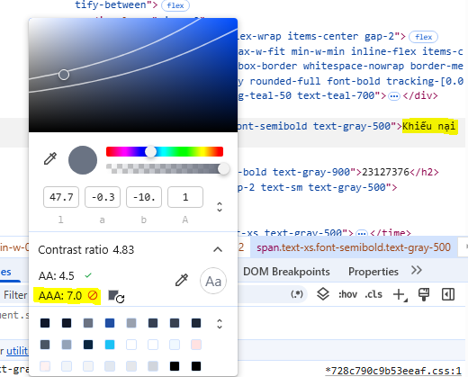
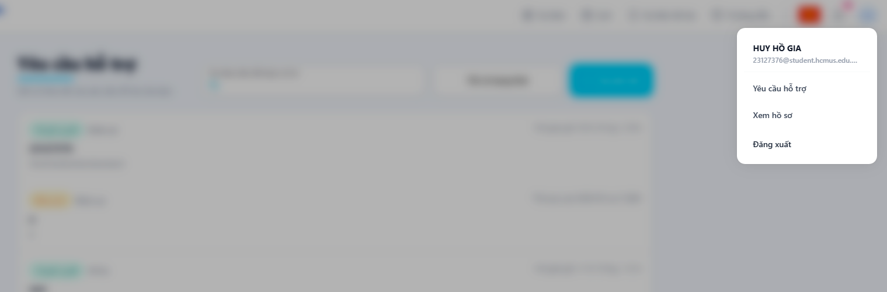
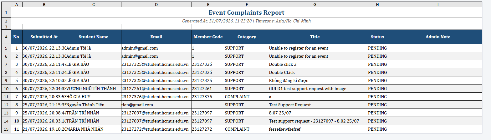
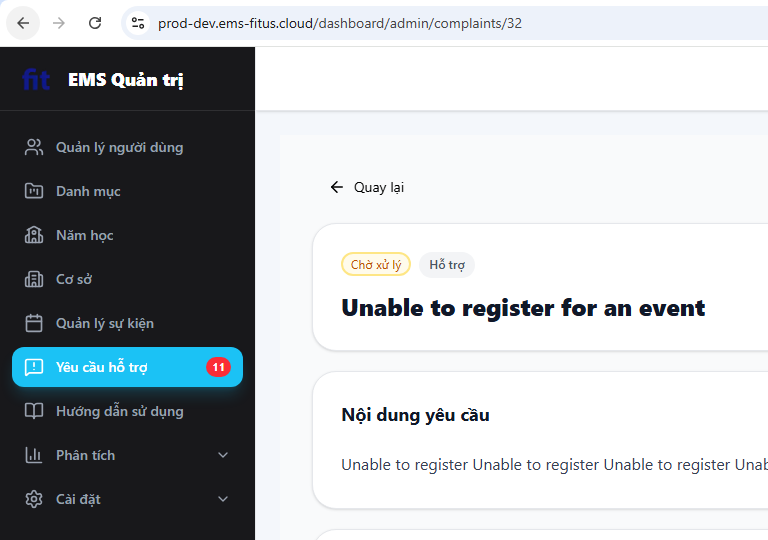
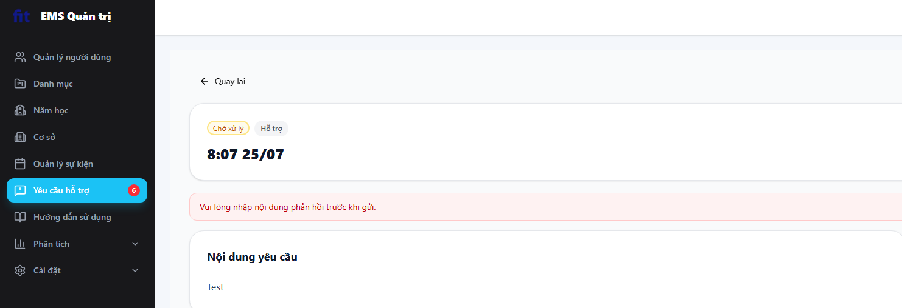
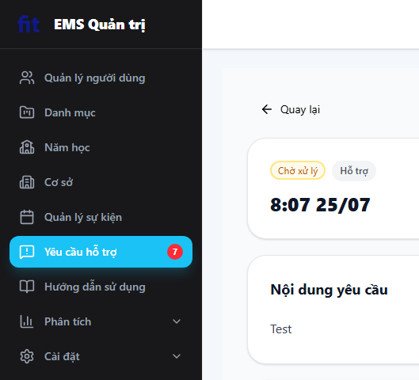

# Checklist Results — Kịch bản D (Support Request)

> Thực thi checklist GUI dùng chung (`00_group/Shared_GUI_Checklist.md`, 57 mục, IA-01→IA-04) trên 4 màn hình D1–D4.
> Quy ước điền:
> - **Kết quả**: `Passed` / `Failed` / `N/A` (N/A nếu mục không áp dụng cho màn hình này — phải ghi lý do ngắn ở cột Notes)
> - **Notes**: bắt buộc điền lý do khi Failed hoặc N/A
> - **Ảnh**: chỉ đính kèm cho mục **Failed** — đặt tên file `D{{n}}_{{MaID}}.png`, lưu tại `01_report/screenshots/D{{n}}/`

## D1 — Form tạo Support Request (User)

| Mã ID | Mục kiểm tra | Kết quả | Notes | Ảnh (nếu Failed) |
|---|---|---|---|---|
| IA01-01 | Font chữ (Typography) rõ ràng, kích thước chữ phân cấp đúng (H1 cho tiêu đề trang, H2-H6 cho các vùng phụ). | Passed | | |
| IA01-02 | Màu sắc nhất quán theo SUT (Primary: Xanh dương cho action chính, Danger: Đỏ cho Xóa/Block). | Passed | | |
| IA01-03 | Độ tương phản màu sắc (Contrast Ratio) giữa chữ và nền đủ cao để dễ đọc (Cater to Universal Usability). | Passed | | |
| IA01-04 | Tính năng chuyển đổi ngôn ngữ EN/VI hoạt động mượt mà, dịch thuật đồng nhất trên toàn bộ hệ thống. | Passed| | |
| IA01-05 | Text không bị tràn, vỡ layout hoặc bị che khuất khi chuyển sang tiếng Việt (do text thường dài hơn tiếng Anh). | Passed | | |
| IA01-06 | Trạng thái rỗng (Empty State) hiển thị thông báo thân thiện và có hình minh họa (VD: Danh sách Users trống). | Passed | | |
| IA01-07 | Trạng thái tải (Loading/Skeleton) hiển thị rõ ràng khi đang gọi API fetch dữ liệu. | Passed | | |
| IA01-08 | Giao diện hiển thị tốt (Responsive) trên Desktop, Tablet, Mobile; không bị lỗi cuộn ngang vô lý. | Passed | | |
| IA01-09 | Hình ảnh (Thumbnail, Banner sự kiện) hiển thị đúng tỷ lệ chuẩn (4:3, 24:9) không bị kéo giãn. | N/A | Trang Support Request không chứa ảnh |
| IA01-10 | Icon sử dụng nhất quán, hình ảnh khớp với thế giới thực (Icon thùng rác = xóa). | Passed | | |
| IA01-11 | Không có thẻ HTML rác hoặc code bị render trực tiếp trên UI (đặc biệt ở các vùng text động). | Passed | | |
| IA01-12 | Footer và Contact hiển thị đúng cấu hình từ Admin Settings trên toàn bộ hệ thống. | Passed | | |
| IA01-13 | Lượng thông tin hiển thị trên màn hình là vừa đủ (adequate), không quá nhồi nhét gây rối hoặc thiếu hụt thông tin cần thiết. | Passed| | |
| IA01-14 | Giao diện được tổ chức bám sát theo các tác vụ của người dùng (Organized by user tasks). Gom nhóm các thông tin liên quan (Proper grouping of related info) một cách hợp lý. | Passed | | |
| IA01-15 | Dữ liệu khi xuất ra file (Export Excel/CSV) phải đồng nhất về ngôn ngữ, định dạng và hiển thị đầy đủ các cột tương ứng với bảng dữ liệu trên web. | N/A | Màn hình tạo form support không có xuất file excel | |
| IA02-01 | Mọi input field đều có Label rõ ràng, ngắn gọn và dễ hiểu. | Passed | | |
| IA02-02 | Các trường bắt buộc phải có dấu `*` màu đỏ hoặc nhãn rõ ràng để phân biệt với trường Tùy chọn (Optional). | Passed | | |
| IA02-03 | Placeholder text cung cấp ví dụ định dạng hữu ích (VD: "Nhập email của bạn..."). | Passed | | |
| IA02-04 | Hỗ trợ thao tác nhanh: Có thể nhấn phím "Enter" để Submit form thay vì phải click chuột vào nút. | Failed|Enter không submit được form | |
| IA02-05 | Validation lỗi định dạng ngay khi nhập (Real-time) hoặc khi blur (VD: sai định dạng email). | Passed | | |
| IA02-06 | Thông báo lỗi (Error message) hiển thị ngay dưới trường bị lỗi (Inline error), không dùng alert chung chung. | Passed | | |
| IA02-07 | Nội dung thông báo lỗi có tính xây dựng, chỉ rõ nguyên nhân và cách khắc phục. | Passed | | |
| IA02-08 | Vùng Upload File/Ảnh ghi rõ ràng quy định về định dạng và dung lượng tối đa. | Passed | |
| IA02-09 | Sau khi upload ảnh thành công, có hiển thị ảnh Preview trước khi submit form. | Passed | | |
| IA02-10 | Nút Submit bị disable hoặc chuyển sang trạng thái loading khi form đang gửi đi để tránh double-submit. | Failed | Vẫn bị double-submit | |
| IA02-11 | Focus order (bấm phím Tab) di chuyển hợp lý từ trên xuống dưới, trái sang phải trong form. | Passed | | |
| IA02-12 | Outline Focus: Có viền bao quanh rõ ràng khi dùng phím Tab di chuyển vào input/button (Accessibility). | Failed | Khi tab vào ô gửi ảnh không thấy outline nhưng khi ấn space hay enter thì vẫn hiện upload ảnh. | |
| IA02-13 | Form có nhiều bước (VD: Reset Password) hiển thị thanh chỉ báo tiến trình (Step Indicator). | N/A | Form chỉ có 1 bước không cần tiến trình. | |
| IA02-14 | Rich-text editor hoạt động đúng các chức năng format cơ bản (In đậm, In nghiêng, Bullet). | N/A | Không có Rich-text editor mọi thứ đều là dạng plain text bình thường | |
| IA02-15 | Các trường dữ liệu (input fields) hiển thị giá trị mặc định (field default) chính xác và hợp lý. | N/A | Không đặt giá trị mặc định cho ô input | |
| IA03-01 | Thanh điều hướng (Navbar/Sidebar) highlight rõ ràng trang hoặc menu đang đứng (Active state). | Failed | Thanh sidebar khi ở trang Support Request không được highlight | |
| IA03-02 | Có Breadcrumb rõ ràng ở các trang con sâu để người dùng dễ dàng hiểu ngữ cảnh và quay lại. | N/A | Không có trang con sâu do chỉ có 1 tầng | |
| IA03-03 | Phân trang (Pagination) hoạt động đúng và tuân theo ánh xạ tự nhiên: Nút lùi bên trái, Nút tiến bên phải. | N/A | Không có phân trang | |
| IA03-04 | Các nút "Back", "Hủy bỏ" luôn sẵn sàng để thoát khỏi luồng hiện tại một cách an toàn. | Passed | | |
| IA03-05 | Bộ lọc (Filter) áp dụng chính xác lên danh sách và UI hiển thị rõ là filter nào đang được bật. | N/A |Form không có filter | |
| IA03-06 | Khung tìm kiếm trả về kết quả đúng; từ khóa tìm kiếm vẫn được giữ lại trong ô input sau khi search. | N/A | Điền biểu mẫu không có search | |
| IA03-07 | Hỗ trợ Deep Linking: Khi copy URL đã filter/search mở ở tab mới, kết quả được giữ nguyên. | N/A | Vì không có filter/search. | |
| IA03-08 | Trạng thái không có kết quả tìm kiếm hiển thị thân thiện, có gợi ý hoặc nút "Xóa bộ lọc". | N/A | Form không có kết quả tìm kiếm. | |
| IA03-09 | Tính năng kéo thả (Reorder) có chỉ báo thị giác (Signifiers) như icon "6 chấm" cho biết có thể kéo. | N/A | Form không có tính năng kéo thả. | |
| IA03-10 | Khi đang kéo thả, item được chọn có phản hồi thị giác (mờ đi, hoặc có viền đổ bóng). | N/A | Form không có tính năng kéo thả. | |
| IA03-11 | Sau khi thả, thứ tự mới được cập nhật ngay lập tức trên UI và thông báo lưu thành công. | N/A | Form không có tính năng kéo thả. | |
| IA04-01 | Hành động thành công trả về Toast Notification màu xanh lá. | N/A | Không có Toast cho màn hình này | |
| IA04-02 | Hành động thất bại trả về Toast Notification màu đỏ với nội dung lỗi cụ thể. | N/A | Không có toast chỉ có inline error trong form. | |
| IA04-03 | Toast notification tự động biến mất sau một khoảng thời gian hợp lý (3-5 giây). | N/A | Không có Toast cho hành động điền/submit form | |
| IA04-04 | Hành động phá hủy (Xóa User, Block User) BẮT BUỘC có Dialog xác nhận (Confirmation). | N/A | Form không có các action trên. | |
| IA04-05 | Nút hành động chính trong Dialog nguy hiểm có màu đỏ (Cảnh báo); nút Hủy nằm ở vị trí an toàn. | N/A | chức năng upload ảnh chỉ mở File Explorer mặc định của OS, không phải UI component của web nên không áp dụng tiêu chí này | |
| IA04-06 | Tương tác chuột (Hover) lên nút bấm, link, hoặc hàng trong table có hiệu ứng chuyển màu hoặc đổ bóng. | Passed | |
| IA04-07 | Tương tác nhấn (Active/Pressed) lên nút bấm có phản hồi lún xuống hoặc đổi màu nền. | Passed| | |
| IA04-08 | Con trỏ chuột đổi thành hình bàn tay (Pointer) khi trỏ vào các vùng có thể tương tác (Clickable). |Passed | | |
| IA04-09 | Các nút bị vô hiệu hóa (Disabled) bị làm mờ, không thể click và đổi con trỏ thành `not-allowed`. | N/A | | |
| IA04-10 | Tooltip xuất hiện giải thích ý nghĩa khi hover vào các nút bấm chỉ có icon (VD: Icon con mắt). | N/A | Không có nút bấm nào chỉ có mỗi icon | |
| IA04-11 | Tích hợp liên kết tới User Guide hoặc Support rõ ràng cho Admin/User khi cần hỗ trợ. | Passed | | |
| IA04-12 | Nút ẩn/hiện mật khẩu (Toggle Password Visibility) hoạt động chính xác trong các form bảo mật. | N/A | Form chỉ điền các thông tin hỗ trợ không yêu cầu bảo mật | |
| IA04-13 | Progress bar hiển thị đúng tỷ lệ % (VD: Tỷ lệ đăng ký, tiến độ duyệt) và đổi màu theo trạng thái. | N/A |Form không có Progress bar | |
| IA04-14 | Dữ liệu Real-time (VD: số lượng Check-in nhảy số) thay đổi trên UI mà không cần reload trang. | N/A| Form là dữ liệu tĩnh. | |
| IA04-15 | Cửa sổ pop-up/dialog phải đảm bảo tính Modality (Correct window modality) – khóa các tương tác với màn hình nền bên dưới khi đang mở. | Passed | | |
| IA04-16 | Trạng thái của các controls và menu đồng bộ và khớp chính xác với trạng thái dữ liệu trong ứng dụng (Synchronization of window object content). | Failed | Mặc dù đang bị limit không thể gửi được yêu cầu hỗ trợ nhưng nút gửi không Disable | |

## D2 — My Requests + Chi tiết (User)

*Danh sách yêu cầu của tôi + trang chi tiết kèm phản hồi chính thức*

| Mã ID | Mục kiểm tra | Kết quả | Notes | Ảnh (nếu Failed) |
|---|---|---|---|---|
| IA01-01 | Font chữ (Typography) rõ ràng, kích thước chữ phân cấp đúng (H1 cho tiêu đề trang, H2-H6 cho các vùng phụ). | Passed | | |
| IA01-02 | Màu sắc nhất quán theo SUT (Primary: Xanh dương cho action chính, Danger: Đỏ cho Xóa/Block). | Passed | | |
| IA01-03 | Độ tương phản màu sắc (Contrast Ratio) giữa chữ và nền đủ cao để dễ đọc (Cater to Universal Usability). | Failed | Vấn đề cần hỗ trợ + Mô tả chi tiết ở ngoài danh sách yêu cầu đang có độ tương phản không tốt| |
| IA01-04 | Tính năng chuyển đổi ngôn ngữ EN/VI hoạt động mượt mà, dịch thuật đồng nhất trên toàn bộ hệ thống. | Passed | | |
| IA01-05 | Text không bị tràn, vỡ layout hoặc bị che khuất khi chuyển sang tiếng Việt (do text thường dài hơn tiếng Anh). | Passed | | |
| IA01-06 | Trạng thái rỗng (Empty State) hiển thị thông báo thân thiện và có hình minh họa (VD: Danh sách Users trống). | Passed | | |
| IA01-07 | Trạng thái tải (Loading/Skeleton) hiển thị rõ ràng khi đang gọi API fetch dữ liệu. | Passed | | |
| IA01-08 | Giao diện hiển thị tốt (Responsive) trên Desktop, Tablet, Mobile; không bị lỗi cuộn ngang vô lý. | Passed | | |
| IA01-09 | Hình ảnh (Thumbnail, Banner sự kiện) hiển thị đúng tỷ lệ chuẩn (4:3, 24:9) không bị kéo giãn. | N/A | Màn hình này không có hình ảnh. | |
| IA01-10 | Icon sử dụng nhất quán, hình ảnh khớp với thế giới thực (Icon thùng rác = xóa). | Passed | | |
| IA01-11 | Không có thẻ HTML rác hoặc code bị render trực tiếp trên UI (đặc biệt ở các vùng text động). | Passed | | |
| IA01-12 | Footer và Contact hiển thị đúng cấu hình từ Admin Settings trên toàn bộ hệ thống. | Passed | | |
| IA01-13 | Lượng thông tin hiển thị trên màn hình là vừa đủ (adequate), không quá nhồi nhét gây rối hoặc thiếu hụt thông tin cần thiết. | Passed | | |
| IA01-14 | Giao diện được tổ chức bám sát theo các tác vụ của người dùng (Organized by user tasks). Gom nhóm các thông tin liên quan (Proper grouping of related info) một cách hợp lý. | Passed | | |
| IA01-15 | Dữ liệu khi xuất ra file (Export Excel/CSV) phải đồng nhất về ngôn ngữ, định dạng và hiển thị đầy đủ các cột tương ứng với bảng dữ liệu trên web. | N/A | Trang này không có export file. | |
| IA02-01 | Mọi input field đều có Label rõ ràng, ngắn gọn và dễ hiểu. | Passed | | |
| IA02-02 | Các trường bắt buộc phải có dấu `*` màu đỏ hoặc nhãn rõ ràng để phân biệt với trường Tùy chọn (Optional). | N/A | Màn hình này không có trường bắt buộc hoặc tuỳ chọn. | |
| IA02-03 | Placeholder text cung cấp ví dụ định dạng hữu ích (VD: "Nhập email của bạn..."). | Passed| | |
| IA02-04 | Hỗ trợ thao tác nhanh: Có thể nhấn phím "Enter" để Submit form thay vì phải click chuột vào nút. | N/A | Màn hình này không có điền form, không có nút submit. | |
| IA02-05 | Validation lỗi định dạng ngay khi nhập (Real-time) hoặc khi blur (VD: sai định dạng email). | N/A | Không có điền form, không có nút submit. | |
| IA02-06 | Thông báo lỗi (Error message) hiển thị ngay dưới trường bị lỗi (Inline error), không dùng alert chung chung. | N/A | Không có điền form, không có nút submit. | |
| IA02-07 | Nội dung thông báo lỗi có tính xây dựng, chỉ rõ nguyên nhân và cách khắc phục. | N/A | Không có điền form, không có nút submit. | |
| IA02-08 | Vùng Upload File/Ảnh ghi rõ ràng quy định về định dạng và dung lượng tối đa. | N/A | Không có Upload File/Ảnh | |
| IA02-09 | Sau khi upload ảnh thành công, có hiển thị ảnh Preview trước khi submit form. | N?A | Không có Upload File/Ảnh | |
| IA02-10 | Nút Submit bị disable hoặc chuyển sang trạng thái loading khi form đang gửi đi để tránh double-submit. | N/A| Không có Upload File/Ảnh | |
| IA02-11 | Focus order (bấm phím Tab) di chuyển hợp lý từ trên xuống dưới, trái sang phải trong form. | N/A | Không có Upload File/Ảnh | |
| IA02-12 | Outline Focus: Có viền bao quanh rõ ràng khi dùng phím Tab di chuyển vào input/button (Accessibility). | Failed | Tại Request đầu tiên không có outline-top mà chỉ có outline-bottom trong khi các request sau lại có outline-top + outline-bottom | .png) .png) |
| IA02-13 | Form có nhiều bước (VD: Reset Password) hiển thị thanh chỉ báo tiến trình (Step Indicator). | N/A | Form không có nhiều bước | |
| IA02-14 | Rich-text editor hoạt động đúng các chức năng format cơ bản (In đậm, In nghiêng, Bullet). | N/A không có Rich-text editor | | |
| IA02-15 | Các trường dữ liệu (input fields) hiển thị giá trị mặc định (field default) chính xác và hợp lý. | Passed | | |
| IA03-01 | Thanh điều hướng (Navbar/Sidebar) highlight rõ ràng trang hoặc menu đang đứng (Active state). | Failed |Thanh sidebar khi ở trang Support Request không được highlight | |
| IA03-02 | Có Breadcrumb rõ ràng ở các trang con sâu để người dùng dễ dàng hiểu ngữ cảnh và quay lại. | Failed |Không có breadcrumb để quay lại trang ||
| IA03-03 | Phân trang (Pagination) hoạt động đúng và tuân theo ánh xạ tự nhiên: Nút lùi bên trái, Nút tiến bên phải. | Passed | |
| IA03-04 | Các nút "Back", "Hủy bỏ" luôn sẵn sàng để thoát khỏi luồng hiện tại một cách an toàn. | N/A | Không có nút back hoặc hủy bỏ | |
| IA03-05 | Bộ lọc (Filter) áp dụng chính xác lên danh sách và UI hiển thị rõ là filter nào đang được bật. | Passed |  | |
| IA03-06 | Khung tìm kiếm trả về kết quả đúng; từ khóa tìm kiếm vẫn được giữ lại trong ô input sau khi search. | Passed | | |
| IA03-07 | Hỗ trợ Deep Linking: Khi copy URL đã filter/search mở ở tab mới, kết quả được giữ nguyên. | Passed | | |
| IA03-08 | Trạng thái không có kết quả tìm kiếm hiển thị thân thiện, có gợi ý hoặc nút "Xóa bộ lọc". | Passed| | |
| IA03-09 | Tính năng kéo thả (Reorder) có chỉ báo thị giác (Signifiers) như icon "6 chấm" cho biết có thể kéo. | N/A | Không có khu vực kéo thả | |
| IA03-10 | Khi đang kéo thả, item được chọn có phản hồi thị giác (mờ đi, hoặc có viền đổ bóng). | N/A | Không có khu vực kéo tả | |
| IA03-11 | Sau khi thả, thứ tự mới được cập nhật ngay lập tức trên UI và thông báo lưu thành công. | N/A| Không có khu vực kéo thả | |
| IA04-01 | Hành động thành công trả về Toast Notification màu xanh lá. | N/A | Không có Toast Notification | |
| IA04-02 | Hành động thất bại trả về Toast Notification màu đỏ với nội dung lỗi cụ thể. | N/A | Không có Toast Notification | |
| IA04-03 | Toast notification tự động biến mất sau một khoảng thời gian hợp lý (3-5 giây). | N/A | Không có Toast Notification | |
| IA04-04 | Hành động phá hủy (Xóa User, Block User) BẮT BUỘC có Dialog xác nhận (Confirmation). | N/A | Không có Dialog xác nhận | |
| IA04-05 | Nút hành động chính trong Dialog nguy hiểm có màu đỏ (Cảnh báo); nút Hủy nằm ở vị trí an toàn. | N/A | Không có Dialog xác nhận | |
| IA04-06 | Tương tác chuột (Hover) lên nút bấm, link, hoặc hàng trong table có hiệu ứng chuyển màu hoặc đổ bóng. | Passed | | |
| IA04-07 | Tương tác nhấn (Active/Pressed) lên nút bấm có phản hồi lún xuống hoặc đổi màu nền. | Passed | | |
| IA04-08 | Con trỏ chuột đổi thành hình bàn tay (Pointer) khi trỏ vào các vùng có thể tương tác (Clickable). | Passed | | |
| IA04-09 | Các nút bị vô hiệu hóa (Disabled) bị làm mờ, không thể click và đổi con trỏ thành `not-allowed`. | Passed | | |
| IA04-10 | Tooltip xuất hiện giải thích ý nghĩa khi hover vào các nút bấm chỉ có icon (VD: Icon con mắt). | Failed| Không có tooltip khi hover vào các nút bấm chỉ có icon. | |
| IA04-11 | Tích hợp liên kết tới User Guide hoặc Support rõ ràng cho Admin/User khi cần hỗ trợ. | Passed | | |
| IA04-12 | Nút ẩn/hiện mật khẩu (Toggle Password Visibility) hoạt động chính xác trong các form bảo mật. | N/A | Không có ô input nhập password | |
| IA04-13 | Progress bar hiển thị đúng tỷ lệ % (VD: Tỷ lệ đăng ký, tiến độ duyệt) và đổi màu theo trạng thái. | N/A | Không có Progress bar | |
| IA04-14 | Dữ liệu Real-time (VD: số lượng Check-in nhảy số) thay đổi trên UI mà không cần reload trang. | N/A | Không có dữ liệu real-time | |
| IA04-15 | Cửa sổ pop-up/dialog phải đảm bảo tính Modality (Correct window modality) – khóa các tương tác với màn hình nền bên dưới khi đang mở. | N/A | Không có cửa sổ pop-up/dialog | |
| IA04-16 | Trạng thái của các controls và menu đồng bộ và khớp chính xác với trạng thái dữ liệu trong ứng dụng (Synchronization of window object content). |Passed | | |

## D3 — Danh sách Support Requests (Admin)

*Tab Pending/Resolved, tìm theo member code hoặc category*

| Mã ID | Mục kiểm tra | Kết quả | Notes | Ảnh (nếu Failed) |
|---|---|---|---|---|
| IA01-01 | Font chữ (Typography) rõ ràng, kích thước chữ phân cấp đúng (H1 cho tiêu đề trang, H2-H6 cho các vùng phụ). | Passed | | |
| IA01-02 | Màu sắc nhất quán theo SUT (Primary: Xanh dương cho action chính, Danger: Đỏ cho Xóa/Block). |Passed | | |
| IA01-03 | Độ tương phản màu sắc (Contrast Ratio) giữa chữ và nền đủ cao để dễ đọc (Cater to Universal Usability). | Failed | Màu sắc dấu < > chuyển trang có Contrast Ratio thấp | |
| IA01-04 | Tính năng chuyển đổi ngôn ngữ EN/VI hoạt động mượt mà, dịch thuật đồng nhất trên toàn bộ hệ thống. | Passed | | |
| IA01-05 | Text không bị tràn, vỡ layout hoặc bị che khuất khi chuyển sang tiếng Việt (do text thường dài hơn tiếng Anh). | Passed | | |
| IA01-06 | Trạng thái rỗng (Empty State) hiển thị thông báo thân thiện và có hình minh họa (VD: Danh sách Users trống). | Passed | | |
| IA01-07 | Trạng thái tải (Loading/Skeleton) hiển thị rõ ràng khi đang gọi API fetch dữ liệu. | Passed | | |
| IA01-08 | Giao diện hiển thị tốt (Responsive) trên Desktop, Tablet, Mobile; không bị lỗi cuộn ngang vô lý. | Failed | Trên mobile giao diện không responsive | |
| IA01-09 | Hình ảnh (Thumbnail, Banner sự kiện) hiển thị đúng tỷ lệ chuẩn (4:3, 24:9) không bị kéo giãn. | N/A | Không có hình ảnh | |
| IA01-10 | Icon sử dụng nhất quán, hình ảnh khớp với thế giới thực (Icon thùng rác = xóa). | Passed | | |
| IA01-11 | Không có thẻ HTML rác hoặc code bị render trực tiếp trên UI (đặc biệt ở các vùng text động). | Passed | | |
| IA01-12 | Footer và Contact hiển thị đúng cấu hình từ Admin Settings trên toàn bộ hệ thống. | N/A | Trang admin không cần footer. | |
| IA01-13 | Lượng thông tin hiển thị trên màn hình là vừa đủ (adequate), không quá nhồi nhét gây rối hoặc thiếu hụt thông tin cần thiết. | Passed | | |
| IA01-14 | Giao diện được tổ chức bám sát theo các tác vụ của người dùng (Organized by user tasks). Gom nhóm các thông tin liên quan (Proper grouping of related info) một cách hợp lý. | Passed | | |
| IA01-15 | Dữ liệu khi xuất ra file (Export Excel/CSV) phải đồng nhất về ngôn ngữ, định dạng và hiển thị đầy đủ các cột tương ứng với bảng dữ liệu trên web. | Failed | Dữ liệu Export ra các cột có ngôn ngữ là tiếng anh mặc dù đang để tiếng việt |  |
| IA02-01 | Mọi input field đều có Label rõ ràng, ngắn gọn và dễ hiểu. | Passed | | |
| IA02-02 | Các trường bắt buộc phải có dấu `*` màu đỏ hoặc nhãn rõ ràng để phân biệt với trường Tùy chọn (Optional). | N/A | Không có trường bắt buộc. | |
| IA02-03 | Placeholder text cung cấp ví dụ định dạng hữu ích (VD: "Nhập email của bạn..."). | Failed | Ô Mã thành viên Không có placeholder và không biết là mã gì phải tự suy nghĩ là mã số sinh viên để nhập. | |
| IA02-04 | Hỗ trợ thao tác nhanh: Có thể nhấn phím "Enter" để Submit form thay vì phải click chuột vào nút. | N/A |Không có submit form| |
| IA02-05 | Validation lỗi định dạng ngay khi nhập (Real-time) hoặc khi blur (VD: sai định dạng email). | N/A | | |
| IA02-06 | Thông báo lỗi (Error message) hiển thị ngay dưới trường bị lỗi (Inline error), không dùng alert chung chung. | N/A | | |
| IA02-07 | Nội dung thông báo lỗi có tính xây dựng, chỉ rõ nguyên nhân và cách khắc phục. | N/A | | |
| IA02-08 | Vùng Upload File/Ảnh ghi rõ ràng quy định về định dạng và dung lượng tối đa. | N/A | | |
| IA02-09 | Sau khi upload ảnh thành công, có hiển thị ảnh Preview trước khi submit form. | N/A | | |
| IA02-10 | Nút Submit bị disable hoặc chuyển sang trạng thái loading khi form đang gửi đi để tránh double-submit. | N/A | | |
| IA02-11 | Focus order (bấm phím Tab) di chuyển hợp lý từ trên xuống dưới, trái sang phải trong form. | Passed | | |
| IA02-12 | Outline Focus: Có viền bao quanh rõ ràng khi dùng phím Tab di chuyển vào input/button (Accessibility). | Failed | Khi tab vào các request hỗ trợ ở dưới màu khó nhìn không có outline. |[Video đính kèm](../01_report/screenshots/D3/D3_IA02-12.mp4) |
| IA02-13 | Form có nhiều bước (VD: Reset Password) hiển thị thanh chỉ báo tiến trình (Step Indicator). | N/A | | |
| IA02-14 | Rich-text editor hoạt động đúng các chức năng format cơ bản (In đậm, In nghiêng, Bullet). | N/A | | |
| IA02-15 | Các trường dữ liệu (input fields) hiển thị giá trị mặc định (field default) chính xác và hợp lý. | N/A | | |
| IA03-01 | Thanh điều hướng (Navbar/Sidebar) highlight rõ ràng trang hoặc menu đang đứng (Active state). | Passed | | |
| IA03-02 | Có Breadcrumb rõ ràng ở các trang con sâu để người dùng dễ dàng hiểu ngữ cảnh và quay lại. | Failed | Không có breadcrumb  | |
| IA03-03 | Phân trang (Pagination) hoạt động đúng và tuân theo ánh xạ tự nhiên: Nút lùi bên trái, Nút tiến bên phải. | Passed | | |
| IA03-04 | Các nút "Back", "Hủy bỏ" luôn sẵn sàng để thoát khỏi luồng hiện tại một cách an toàn. | N/A | | |
| IA03-05 | Bộ lọc (Filter) áp dụng chính xác lên danh sách và UI hiển thị rõ là filter nào đang được bật. | Passed | | |
| IA03-06 | Khung tìm kiếm trả về kết quả đúng; từ khóa tìm kiếm vẫn được giữ lại trong ô input sau khi search. | Passed | | |
| IA03-07 | Hỗ trợ Deep Linking: Khi copy URL đã filter/search mở ở tab mới, kết quả được giữ nguyên. | Passed | | |
| IA03-08 | Trạng thái không có kết quả tìm kiếm hiển thị thân thiện, có gợi ý hoặc nút "Xóa bộ lọc". | Passed | | |
| IA03-09 | Tính năng kéo thả (Reorder) có chỉ báo thị giác (Signifiers) như icon "6 chấm" cho biết có thể kéo. | N/A | | |
| IA03-10 | Khi đang kéo thả, item được chọn có phản hồi thị giác (mờ đi, hoặc có viền đổ bóng). | N/A | | |
| IA03-11 | Sau khi thả, thứ tự mới được cập nhật ngay lập tức trên UI và thông báo lưu thành công. | N/A | | |
| IA04-01 | Hành động thành công trả về Toast Notification màu xanh lá. | N/A | | |
| IA04-02 | Hành động thất bại trả về Toast Notification màu đỏ với nội dung lỗi cụ thể. | N/A | | |
| IA04-03 | Toast notification tự động biến mất sau một khoảng thời gian hợp lý (3-5 giây). | N/A | | |
| IA04-04 | Hành động phá hủy (Xóa User, Block User) BẮT BUỘC có Dialog xác nhận (Confirmation). | N/A | | |
| IA04-05 | Nút hành động chính trong Dialog nguy hiểm có màu đỏ (Cảnh báo); nút Hủy nằm ở vị trí an toàn. | N/A | | |
| IA04-06 | Tương tác chuột (Hover) lên nút bấm, link, hoặc hàng trong table có hiệu ứng chuyển màu hoặc đổ bóng. | Passed | | |
| IA04-07 | Tương tác nhấn (Active/Pressed) lên nút bấm có phản hồi lún xuống hoặc đổi màu nền. | Passed | | |
| IA04-08 | Con trỏ chuột đổi thành hình bàn tay (Pointer) khi trỏ vào các vùng có thể tương tác (Clickable). | Passed | | |
| IA04-09 | Các nút bị vô hiệu hóa (Disabled) bị làm mờ, không thể click và đổi con trỏ thành `not-allowed`. | Passed | | |
| IA04-10 | Tooltip xuất hiện giải thích ý nghĩa khi hover vào các nút bấm chỉ có icon (VD: Icon con mắt). | Failed |Tại icon xoá filter không có tooltip | |
| IA04-11 | Tích hợp liên kết tới User Guide hoặc Support rõ ràng cho Admin/User khi cần hỗ trợ. | Passed | | |
| IA04-12 | Nút ẩn/hiện mật khẩu (Toggle Password Visibility) hoạt động chính xác trong các form bảo mật. | N/A | | |
| IA04-13 | Progress bar hiển thị đúng tỷ lệ % (VD: Tỷ lệ đăng ký, tiến độ duyệt) và đổi màu theo trạng thái. | N/A | | |
| IA04-14 | Dữ liệu Real-time (VD: số lượng Check-in nhảy số) thay đổi trên UI mà không cần reload trang. | Failed | Không có realtime phải F5 để lấy dữ liệu mới nhất. | [Video](../01_report/screenshots/D3/D3_IA04-14.mp4) |
| IA04-15 | Cửa sổ pop-up/dialog phải đảm bảo tính Modality (Correct window modality) – khóa các tương tác với màn hình nền bên dưới khi đang mở. | Passed | | |
| IA04-16 | Trạng thái của các controls và menu đồng bộ và khớp chính xác với trạng thái dữ liệu trong ứng dụng (Synchronization of window object content). | N/A | | |

## D4 — Chi tiết Request (Admin)

*Lightbox ảnh, internal note, nội dung phản hồi chính thức*

| Mã ID | Mục kiểm tra | Kết quả | Notes | Ảnh (nếu Failed) |
|---|---|---|---|---|
| IA01-01 | Font chữ (Typography) rõ ràng, kích thước chữ phân cấp đúng (H1 cho tiêu đề trang, H2-H6 cho các vùng phụ). | Passed | | |
| IA01-02 | Màu sắc nhất quán theo SUT (Primary: Xanh dương cho action chính, Danger: Đỏ cho Xóa/Block). | Passed | | |
| IA01-03 | Độ tương phản màu sắc (Contrast Ratio) giữa chữ và nền đủ cao để dễ đọc (Cater to Universal Usability). | Passed | | |
| IA01-04 | Tính năng chuyển đổi ngôn ngữ EN/VI hoạt động mượt mà, dịch thuật đồng nhất trên toàn bộ hệ thống. | Passed | | |
| IA01-05 | Text không bị tràn, vỡ layout hoặc bị che khuất khi chuyển sang tiếng Việt (do text thường dài hơn tiếng Anh). | Passed | | |
| IA01-06 | Trạng thái rỗng (Empty State) hiển thị thông báo thân thiện và có hình minh họa (VD: Danh sách Users trống). | N/A | | |
| IA01-07 | Trạng thái tải (Loading/Skeleton) hiển thị rõ ràng khi đang gọi API fetch dữ liệu. | Passed | | |
| IA01-08 | Giao diện hiển thị tốt (Responsive) trên Desktop, Tablet, Mobile; không bị lỗi cuộn ngang vô lý. | Failed |Không responsive trên mobile | |
| IA01-09 | Hình ảnh (Thumbnail, Banner sự kiện) hiển thị đúng tỷ lệ chuẩn (4:3, 24:9) không bị kéo giãn. | N/A | Không có banner hình ảnh. | |
| IA01-10 | Icon sử dụng nhất quán, hình ảnh khớp với thế giới thực (Icon thùng rác = xóa). | Passed | | |
| IA01-11 | Không có thẻ HTML rác hoặc code bị render trực tiếp trên UI (đặc biệt ở các vùng text động). | Passed | | |
| IA01-12 | Footer và Contact hiển thị đúng cấu hình từ Admin Settings trên toàn bộ hệ thống. | N/A | Không có footer và contact trong trang Admin. | |
| IA01-13 | Lượng thông tin hiển thị trên màn hình là vừa đủ (adequate), không quá nhồi nhét gây rối hoặc thiếu hụt thông tin cần thiết. | Passed | | |
| IA01-14 | Giao diện được tổ chức bám sát theo các tác vụ của người dùng (Organized by user tasks). Gom nhóm các thông tin liên quan (Proper grouping of related info) một cách hợp lý. | Passed | | |
| IA01-15 | Dữ liệu khi xuất ra file (Export Excel/CSV) phải đồng nhất về ngôn ngữ, định dạng và hiển thị đầy đủ các cột tương ứng với bảng dữ liệu trên web. | N/A | Không có tính năng export. | |
| IA02-01 | Mọi input field đều có Label rõ ràng, ngắn gọn và dễ hiểu. | Passed | | |
| IA02-02 | Các trường bắt buộc phải có dấu `*` màu đỏ hoặc nhãn rõ ràng để phân biệt với trường Tùy chọn (Optional). | Failed |Trường "Nội dung phản hồi" là trường bắt buộc nhưng không có `*` |  |
| IA02-03 | Placeholder text cung cấp ví dụ định dạng hữu ích (VD: "Nhập email của bạn..."). | Passed | | |
| IA02-04 | Hỗ trợ thao tác nhanh: Có thể nhấn phím "Enter" để Submit form thay vì phải click chuột vào nút. | Failed | Ấn Enter không có gửi phản hồi. | |
| IA02-05 | Validation lỗi định dạng ngay khi nhập (Real-time) hoặc khi blur (VD: sai định dạng email). | N/A | Form không có Validation lỗi. | |
| IA02-06 | Thông báo lỗi (Error message) hiển thị ngay dưới trường bị lỗi (Inline error), không dùng alert chung chung. | Failed | Thông báo của ô input nhập nội dung phản hồi không nằm ngay dưới trường đó. | |
| IA02-07 | Nội dung thông báo lỗi có tính xây dựng, chỉ rõ nguyên nhân và cách khắc phục. | Passed | | |
| IA02-08 | Vùng Upload File/Ảnh ghi rõ ràng quy định về định dạng và dung lượng tối đa. | N/A | Không có vùng upload file | |
| IA02-09 | Sau khi upload ảnh thành công, có hiển thị ảnh Preview trước khi submit form. | N/A | Không có vùng upload file | |
| IA02-10 | Nút Submit bị disable hoặc chuyển sang trạng thái loading khi form đang gửi đi để tránh double-submit. | Passed | | |
| IA02-11 | Focus order (bấm phím Tab) di chuyển hợp lý từ trên xuống dưới, trái sang phải trong form. | Passed | | |
| IA02-12 | Outline Focus: Có viền bao quanh rõ ràng khi dùng phím Tab di chuyển vào input/button (Accessibility). | Passed | | |
| IA02-13 | Form có nhiều bước (VD: Reset Password) hiển thị thanh chỉ báo tiến trình (Step Indicator). | N/A | Không có form có nhiều bước. | |
| IA02-14 | Rich-text editor hoạt động đúng các chức năng format cơ bản (In đậm, In nghiêng, Bullet). | N/A | Không có rich-text editor | |
| IA02-15 | Các trường dữ liệu (input fields) hiển thị giá trị mặc định (field default) chính xác và hợp lý. | Passed | | |
| IA03-01 | Thanh điều hướng (Navbar/Sidebar) highlight rõ ràng trang hoặc menu đang đứng (Active state). | Passed | | |
| IA03-02 | Có Breadcrumb rõ ràng ở các trang con sâu để người dùng dễ dàng hiểu ngữ cảnh và quay lại. | Failed | Không có Breadcrumb |  |
| IA03-03 | Phân trang (Pagination) hoạt động đúng và tuân theo ánh xạ tự nhiên: Nút lùi bên trái, Nút tiến bên phải. | N/A | Không có phân trang trong màn hình này | |
| IA03-04 | Các nút "Back", "Hủy bỏ" luôn sẵn sàng để thoát khỏi luồng hiện tại một cách an toàn. | Passed| | |
| IA03-05 | Bộ lọc (Filter) áp dụng chính xác lên danh sách và UI hiển thị rõ là filter nào đang được bật. | N/A | Không có filter trong màn hình này. | |
| IA03-06 | Khung tìm kiếm trả về kết quả đúng; từ khóa tìm kiếm vẫn được giữ lại trong ô input sau khi search. | N/A | Không có search trong màn hình này. | |
| IA03-07 | Hỗ trợ Deep Linking: Khi copy URL đã filter/search mở ở tab mới, kết quả được giữ nguyên. | N/A | | Mỗi yêu cầu được ấn từ list không có search. |
| IA03-08 | Trạng thái không có kết quả tìm kiếm hiển thị thân thiện, có gợi ý hoặc nút "Xóa bộ lọc". | N/A | Không có kết quả tìm kiếm trong màn hình này. | |
| IA03-09 | Tính năng kéo thả (Reorder) có chỉ báo thị giác (Signifiers) như icon "6 chấm" cho biết có thể kéo. | N/A | Không có tính năng kéo thả trong màn hình này. | |
| IA03-10 | Khi đang kéo thả, item được chọn có phản hồi thị giác (mờ đi, hoặc có viền đổ bóng). | N/A | Không có tính năng kéo thả trong màn hình này. | |
| IA03-11 | Sau khi thả, thứ tự mới được cập nhật ngay lập tức trên UI và thông báo lưu thành công. | N/A | Không có tính năng kéo thả trong màn hình này. | |
| IA04-01 | Hành động thành công trả về Toast Notification màu xanh lá. | Passed | | |
| IA04-02 | Hành động thất bại trả về Toast Notification màu đỏ với nội dung lỗi cụ thể. | N/A | Chưa có trường hợp thất bại. | |
| IA04-03 | Toast notification tự động biến mất sau một khoảng thời gian hợp lý (3-5 giây). | Passed | | |
| IA04-04 | Hành động phá hủy (Xóa User, Block User) BẮT BUỘC có Dialog xác nhận (Confirmation). | N/A | Không có hành động phá huỷ. | |
| IA04-05 | Nút hành động chính trong Dialog nguy hiểm có màu đỏ (Cảnh báo); nút Hủy nằm ở vị trí an toàn. | N/A | Không có hành động phá huỷ. | |
| IA04-06 | Tương tác chuột (Hover) lên nút bấm, link, hoặc hàng trong table có hiệu ứng chuyển màu hoặc đổ bóng. | Passed | | |
| IA04-07 | Tương tác nhấn (Active/Pressed) lên nút bấm có phản hồi lún xuống hoặc đổi màu nền. | Passed| | |
| IA04-08 | Con trỏ chuột đổi thành hình bàn tay (Pointer) khi trỏ vào các vùng có thể tương tác (Clickable). | Passed| | |
| IA04-09 | Các nút bị vô hiệu hóa (Disabled) bị làm mờ, không thể click và đổi con trỏ thành `not-allowed`. | N/A | Không có nút bị vô hiệu hoá. | |
| IA04-10 | Tooltip xuất hiện giải thích ý nghĩa khi hover vào các nút bấm chỉ có icon (VD: Icon con mắt). | N/A | Không có nút bấm nào chỉ có icon. | |
| IA04-11 | Tích hợp liên kết tới User Guide hoặc Support rõ ràng cho Admin/User khi cần hỗ trợ. | Passed | | |
| IA04-12 | Nút ẩn/hiện mật khẩu (Toggle Password Visibility) hoạt động chính xác trong các form bảo mật. | N/A | Không có nút ẩn/hiện mật khẩu. | |
| IA04-13 | Progress bar hiển thị đúng tỷ lệ % (VD: Tỷ lệ đăng ký, tiến độ duyệt) và đổi màu theo trạng thái. | N/A | Không có progress bar. | |
| IA04-14 | Dữ liệu Real-time (VD: số lượng Check-in nhảy số) thay đổi trên UI mà không cần reload trang. | N/A | Không có dữ liệu real-time. | |
| IA04-15 | Cửa sổ pop-up/dialog phải đảm bảo tính Modality (Correct window modality) – khóa các tương tác với màn hình nền bên dưới khi đang mở. | N/A | Không có pop-up/dialog. | |
| IA04-16 | Trạng thái của các controls và menu đồng bộ và khớp chính xác với trạng thái dữ liệu trong ứng dụng (Synchronization of window object content). | N/A | Không có điều này. | |

---

## Tổng hợp lỗi phát hiện

Với mỗi mục **Failed**, tạo 1 file bug report riêng trong `02_task1b_checklist_execution/Bug_Reports/BUG-D{n}-{seq}.md` (dùng template bên dưới), đồng thời liệt kê nhanh ở bảng này để dễ theo dõi:

| Bug ID | Màn hình | Mã ID checklist | Mô tả ngắn | Severity (0-4) |
|---|---|---|---|---|
| BUG-D1-01 | D1 | | | |

