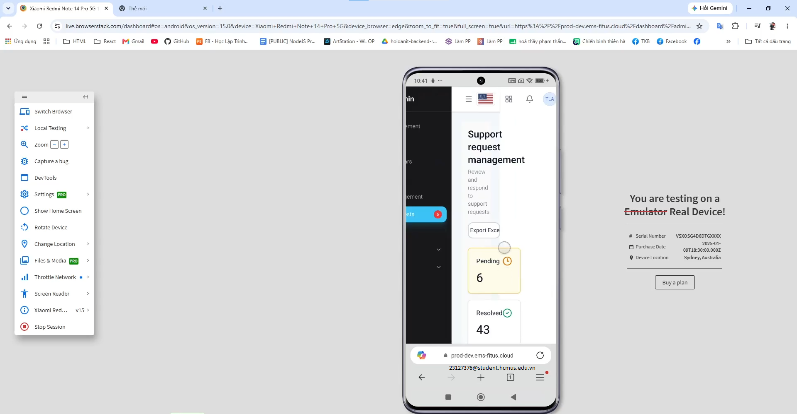

# Compatibility Matrix — Cross-Browser / Cross-Platform

**Màn hình kiểm tra:** D1 (Form tạo Support Request), D2 (My Requests + Chi tiết), D3 (Danh sách Support Requests - Admin)
 

**Công cụ:** BrowserStack
---

## Kế hoạch chạy tối thiểu (5 lần/màn hình — đủ phủ 3 OS × 5 browser × 3 device)

| Run | Browser | Hệ điều hành | Loại thiết bị |
|---|---|---|---|
| 1 | Chrome | Windows | Desktop |
| 2 | Firefox | macOS | Desktop |
| 3 | Safari | macOS | Desktop |
| 4 | Edge | Android | Phone |
| 5 | Samsung Internet | Android | Tablet |

---

## D1 — Form tạo Support Request

| Run | Browser/OS/Device | Kết quả | Ghi chú (nếu Fail) | Ảnh |
|---|---|---|---|---|
| 1 | Chrome / Windows / Desktop | Pass| | |
| 2 | Firefox / macOS / Desktop | Pass | | |
| 3 | Safari / macOS / Desktop | Pass | | |
| 4 | Edge / Android / Phone |Pass | | |
| 5 | Samsung Internet / Android / Tablet | Pass | | |

## D2 — My Requests + Chi tiết

| Run | Browser/OS/Device | Kết quả | Ghi chú (nếu Fail) | Ảnh |
|---|---|---|---|---|
| 1 | Chrome / Windows / Desktop |Pass | | |
| 2 | Firefox / macOS / Desktop | Pass | | |
| 3 | Safari / macOS / Desktop |Pass | | |
| 4 | Edge / Android / Phone |Pass | | |
| 5 | Samsung Internet / Android / Tablet | Pass                                                        
| | |

## D3 — Danh sách Support Requests (Admin)

| Run | Browser/OS/Device | Kết quả | Ghi chú (nếu Fail) | Ảnh |
|---|---|---|---|---|
| 1 | Chrome / Windows / Desktop |Pass | | |
| 2 | Firefox / macOS / Desktop |Pass | | |
| 3 | Safari / macOS / Desktop |Pass | | |
| 4 | Edge / Android / Phone |Failed | Không responsive |  |
| 5 | Samsung Internet / Android / Tablet |Pass | | |

